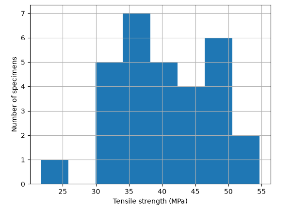
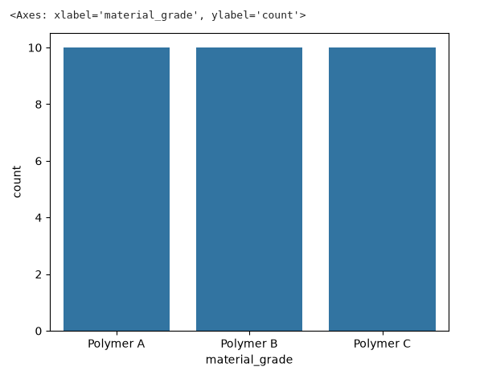

Data Processing for Machine Learning 
====================================

This supplemental reading introduces basic data science concepts for machine learning 
and provides hands-on examples that leverage the Python programming ecosystem, 
including ``pandas``, ``numpy`` and ``maplotlib`` libraries. 

By the end of this reading students should be able to: 

1. Distinguish rows, features, targets, and identifiers.
2. Inspect numeric and categorical variables
3. Use ``pandas``, ``numpy``, and ``matplotlib`` for basic data analysis. 
4. Explain how to treat categorical variables 
5. Identify missing values and implement some basic methods for treating them. 
6. Distinguish regression from classification 
7. Choose a reasonable loss function for a basic prediction problem. 
8. Explain the purpose of training, validation and test data. 

In order to illustrate the concepts in what follows, we will make use of a synthetic materials dataset, and 
we will manipulate it using Python code. We recommend that you follow along using VSCode running against 
your student VM where all necessary libraries are preinstalled. 

The dataset we will use describes manufactured materials ("polymers") from a fictional industrial engineering lab. 
Each observation (row) corresponds to a single specimen that was produced using their machine. Three different
grades of materials (corresponding to three different polymer formulas) can be produced. 
As the specimens are being produced, sensors in the lab record the average temperature, pressure and "feed rate", 
that is, the rate that the raw material is fed into the machine. After the specimens are produced, 
they go through a testing and quality assurance process where first their tensile strength is measured 
and finally, the QA test determines if the specimen is defective. The dataset is available from the 
class website `here <https://raw.githubusercontent.com/joestubbs/coe-379l-fa26/refs/heads/main/data/unit01/polymer_samples.csv>`_. 

Datasets and DataFrames
-----------------------
Machine Learning typically begins with raw data or *observations* about a process or phenomenon. There 
are many different forms that such raw data can take. In a tabular dataset, each row normally 
represents a single observation, and each column records one property of that observation. 

For example, in the polymer dataset, one observation is one manufacturing run and the 
specimen produced by that run. The temperature, pressure, and feed rate are average measured 
process conditions. The material grade identifies the polymer formulation. Tensile strength and 
the defect label are outcomes measured after manufacturing.

We'll use the ``pandas`` library to read the raw CSV file into a dataframe object. A dataframe is a 
like a 2d-array that can hold heterogeneous data. Each data frame contains rows and columns, like a 
spreadsheet or database table. 

.. code-block:: python 

    import pandas as pd

    # create a dataframe directly from the raw csv
    url = "https://raw.githubusercontent.com/joestubbs/coe-379l-fa26/refs/heads/main/data/unit01/polymer_samples.csv"
    df = pd.read_csv(url)

    type(df)
    --> pandas.DataFrame

The dataframe API has a variety of useful methods for accessing and manipulating the data it contains. 
We'll use the ``info()`` to get a high-level description of the dataframe, and the ``head()`` method 
to inspect the first several rows. 

.. code-block:: python 

    df.info()

You should see an output similar to the following:

.. code-block:: console 

    <class 'pandas.DataFrame'>
    RangeIndex: 30 entries, 0 to 29
    Data columns (total 7 columns):
    #   Column                Non-Null Count  Dtype  
    ---  ------                --------------  -----  
    0   sample_id             30 non-null     str    
    1   material_grade        30 non-null     str    
    2   temperature_c         30 non-null     int64  
    3   pressure_mpa          30 non-null     float64
    4   feed_rate_mm_s        30 non-null     int64  
    5   tensile_strength_mpa  30 non-null     float64
    6   defective             30 non-null     bool   
    dtypes: bool(1), float64(2), int64(2), str(2)
    memory usage: 1.6 KB

Features, Targets, and Identifiers
^^^^^^^^^^^^^^^^^^^^^^^^^^^^^^^^^^
A *feature* is a value supplied to the model as an input. A *target* is the value we want the model to 
predict. An *identifier* distinguishes a specific observation but usually does not describe the 
process that generated its outcome. We learned in class that if the target is a continuous variable, 
then the problem is a regression problem, while if the target is a discrete variable (i.e., takes 
only finitely many values), then the problem is a *classification* problem. 

A single dataset can support multiple prediction problems. For example, with the materials dataset, 
we could choose to predict *tensile_strength_mpa*, a continuous variable, and thus a regression 
problem, or we could choose to predict *defective*, a discrete variable with just two possible values 
(True and False), and thus a classification problem. 

.. note:: 

    A column's role depends on the question. Tensile strength is a target in the regression 
    problem, but it could also be an input (feature) in a different problem (e.g., when predicting 
    defective). Whether that would be legitimate depends on when the value becomes available 
    and what decision the system is intended to support.

Inspecting the Data 
-------------------

Before fitting a model, it is always best to inspect the dataset. The pandas DataFrame API provides 
operations that answer different questions, for example: 

* ``df.shape`` --  How many rows and columns?
* ``df.dtypes`` --  What type was assigned to each column?
* ``df.describe()`` --  What are the numerical ranges and summary statistics?
* ``df.isna().sum()``  How many values are missing in each column?

These operations help you understand the quality of the data and diagnose certain kinds 
of issues. In the real world, datasets can contain any number of issues, including missing data, 
data with the wrong type, or data that cannot be "correct". And here, "correct" is relative 
to the context at hand. 

Consider a column containing temperature values like the *temperature_c* column. We know temperature 
in general should be a numeric value, so if the column contains the string "abc", we know it is not valid. 
But usually we can say more depending on the context. For polymers like the ones manufactured in the lab, valid 
temperature values could be between 180C and 250C, but those would not be valid values for the average 
daily Austin temperature (at least, I hope not!)

Pandas and Numpy 
^^^^^^^^^^^^^^^^
In general, we use ``pandas`` and ``numpy`` for different tasks in ML. 
Typically, we use ``numpy`` to work with numerical arrays and vectors. It is very fast and efficient, because 
We use ``pandas`` to work with entire spreadsheets, database tables or other data. It is especially convenient 
when columns have possibly different data types. 
ML libraries often accept either pandas DataFrames or numpy arrays and may convert between them internally.

Once we have read an entire dataset into a dataframe, we can select individual columns by name using 
a dictionary-like access syntax, e.g., ``df["temperature_c"]`` returns just the temperature columns. 
The object type returned is technically a pandas ``Series``. 
We can also select multiple columns using a double-bracket (i.e., ``[[ -- ]]``) syntax. In that case, 
a full DataFrame object is returned. 
We can then perform vectorized operations 
on the entire column without looping --- this is by far the most efficient way to work with the data. 

.. code-block:: python 

    temperatures = df["temperature_c"]         # Pandas Series
    x = df[["temperature_c", "pressure_mpa"]]  # Pandas DataFrame
    x_array = x.to_numpy()                     # Numpy array

    prediction = 0.15 * df["temperature_c"] + 10.0
    per_example_loss = (df["tensile_strength_mpa"] - prediction) ** 2

.. note:: 

    If you find yourself writing a ``for`` loop in Python to iterate over a Pandas object 
    stop and ask if there is another way to implement the code! The loop can be very 
    inefficient. 

Categorical Variables 
^^^^^^^^^^^^^^^^^^^^^
The ``material_grade`` column contains names rather than measured quantities. Most numerical models 
cannot operate directly on strings, so the categories must be represented numerically. A tempting 
approach is to replace three grades with the integers 1, 2, and 3. That representation introduces 
an unintended ordering and distance: it suggests that grade 3 is greater than grade 2 and twice 
grade 1, for example. Those relationships have no stated meaning here.

For an unordered, or nominal, category, a common representation is *one-hot encoding*. One-hot encoding 
creates one boolean column for each possible category. We use 0 and 1 for the values of the columns to keep 
them numeric. Then, for each observation, exactly one of these boolean columns is set to 1 
for each observation, and the others are 0. This encodes "membership" in the associated category. 
The ``get_dummies()`` function from pandas will apply one-hot encoding to a set of one or more columns 
and return a new dataframe. For example: 

.. code-block:: python3 

    encoded = pd.get_dummies(
        df,
        columns=["material_grade"],
        dtype=float,
    )

    encoded.filter(like="material_grade").head()

 	            material_grade_Polymer A 	material_grade_Polymer B 	material_grade_Polymer C
        0 	            1.0 	                      0.0 	                    0.0
        1 	            1.0 	                      0.0 	                    0.0
        2 	            1.0 	                      0.0 	                    0.0
        3 	            1.0 	                      0.0 	                    0.0
        4 	            1.0 	                      0.0 	                    0.0

After encoding, a model can learn a separate effect associated with each material grade without 
treating the grade names as a numerical scale. This does not mean one-hot encoding is always best for 
categorical variables. Some categories have a real order while others have thousands of possible values. 
In either of these cases, one-hot encoding should be avoided. 
The representation should match the meaning and scale of the variable.

Missing Values 
^^^^^^^^^^^^^^

A value can be "missing" from a dataset for a variety of reasons. A sensor could have failed, 
a measurement could have just not been recorded, or the data could have been corrupted in transit. 
There are multiple approaches to treating missing values including: removing the observation altogether 
or filling in the missing value, called *inputing*. Usually, removing the observation altogether is 
less desirable because we want to use as much data as possible when training a model. When inputing, 
we can use various methods, from filling the missing values with the mean of the entire column (*univariate 
inputation*), to more elaborate methods such as inferring the missing value based on other column values 
(*mutlivariate imputation*) or even training a machine learning model just to predict the missing values. 

Visualizing Relationships 
-------------------------

Summary statistics give us a good overview of a dataset, but visualization can reveal patterns that 
are hard to find in the summary numbers. Visualization involves identifying clusters, outliers, 
nonlinear relationships, changes in variability, and/or differences between groups. 

Histogram 
^^^^^^^^^
A histogram or boxplot helps reveal the range and shape of a numeric variable. For example, a 
histogram of tensile strength can show whether most samples are concentrated in a narrow interval or 
spread across the full observed range. A grouped boxplot can reveal whether material grades tend to 
have different strengths.

.. code-block:: python 

    import matplotlib.pyplot as plt

    df["tensile_strength_mpa"].hist(bins=8)
    plt.xlabel("Tensile strength (MPa)")
    plt.ylabel("Number of specimens")
    plt.show()    

Count Plots 
^^^^^^^^^^^
Count plots are another of useful plot we will introduce. Count plots are used for categorical data in 
the same way that histograms are for numeric data. The seaborn package has a very nice API for 
count plots. 

.. code-block:: python 

    import seaborn as sns
    sns.countplot(x=df['material_grade'])

Predictions and Loss 
---------------------

As we have discussed, s supervised-learning model is a parameterized function that maps input 
features to a prediction. Mathematically, we write: 

.. math:: 

    \widehat{y}_i = f_\theta(x_i) 

Here, :math:`x_i` is the feature vector from the :math:`i^{th}` observation, :math:`\theta` denotes the model parameters, 
and :math:`\widehat{y}_i` is the model's prediction. During training, we update the parameters to reduce a loss function. During inference, 
the trained parameters are held fixed while the model makes predictions on new inputs.

Regression Loss 
^^^^^^^^^^^^^^^

For a regression problem, the error for one observation is the difference between the measured target 
:math:`y_i` and the prediction :math:`\widehat{y}_i`. The loss converts that error into a quantity 
the training procedure attempts to reduce. For regression problems, it is common to use mean 
squared error as we saw last week: 

.. math:: 

    MSE = \frac{1}{|D|} \sum_{d\in D} (y_d - f_\theta(d))^2

However, one thing to note is that because the error is squared, large errors tend to influence MSE 
disproportionately. This can be desirable when large errors are especially harmful, but it also makes MSE 
sensitive to outliers. An alternative to MSE is mean absolute error (MAE) which simply replaces the 
square with absolute value:

.. math:: 

    MAE = \frac{1}{|D|} \sum_{d\in D} |y_d - f_\theta(d)|

MAE grows linearly with the magnitude of the error, so a single large error has less influence than it 
would under MSE. Choosing the appropriate loss function requires considerting which kinds of errors 
the learning procedure should emphasize.

Classification and Decision Thresholds 
^^^^^^^^^^^^^^^^^^^^^^^^^^^^^^^^^^^^^^
We learned in class that one can use a *decision threshold* to decide a class label from a continuous variable.
With a binary classifier where you are trying to predict whether a sample belongs to a single class lable, 
the model often produces a single probability.  For example, the model might output a 0.73 probability 
that a specimen is defective. The surrounding application can then apply a threshold such as 0.50 to 
convert that probability into an actual classification.

Note that changing the threshold changes the model's behavior without retraining the model. Lowering the 
threshold will generally detect more possible defects, but it may also flag more acceptable samples (i.e., 
generate more false positives). This is one reason accuracy alone is often insufficient for evaluating a classifier.

Binary cross-entropy evaluates the model's predicted probabilities. It gives a large penalty when a model 
assigns high confidence to the wrong class and a small penalty when it assigns high probability to the 
correct class. 

For a multiclass problem, categorical cross-entropy plays a similar role across multiple class 
probabilities. When class labels are stored as integers rather than one-hot vectors, libraries 
commonly call the corresponding loss sparse categorical cross-entropy.

To achieve these features, both binary cross-entropy (BCE) and categorical cross-entropy 
use :math:`log`, for example:

.. math:: 

    (BCE) \;\; \;\; L(y, \hat{y}) = -\big[ y \log(\hat{y}) + (1 - y) \log(1 - \hat{y}) \big]

However, the formula is not important for this class. 

Training and Validation 
------------------------

The goal with machine learning is to train a model that can infer patterns that generalize to new 
samples, not just the ones it has seen during training. But we have to be careful --- 
in general, a low loss on training examples does not mean that the model will perform well on new 
data. Therefore, the key question is not "how well did the model do on the training data?" but 
rather, "did the model learn a pattern that generalized to **new** samples?"

The primary technique in ML is to split the dataset into three separate datasets: *training*, *validation*
and *test*. Training data are used to update model parameters. Validation data are used during 
development to compare choices that are independent of the model's parameters ---referred to as *hyperparameters* ---
such as model architecture and training duration. 
Test data are held back for a final evaluation after all of those choices have been made.
If we repeatedly evaluate the model on the test test, and we modify the system in response, the test set has effectively 
become another validation set. **This is a cardinal sin in machine learning!**
A new, untouched evaluation set would then be needed for an unbiased final estimate.

The polymer dataset contains only 30 observations, so any split will be extremely small and unreliable. 
We can still perform a split to learn the mechanics, but we should not interpret a difference of one 
or two correct predictions as strong evidence that one model is better.

Exercises: Test Your Understanding 
----------------------------------