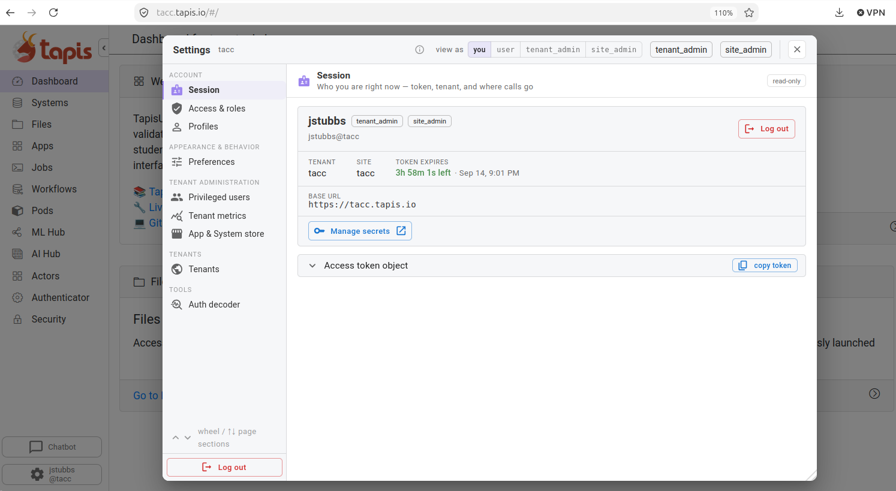

Using Local Language Models: APIs, Hallucinations, Types, and Structured Responses
==================================================================================

Foundation models become useful components of software systems when applications can call them through
well-defined interfaces. The model itself generates a sequence of tokens, but the surrounding application
must decide how to construct the request, interpret the response, detect failures, and determine whether the
generated content is safe to use.

This reading introduces four related ideas:

1. calling a language model through an OpenAI-compatible HTTP API
2. observing and classifying errors in a post-cutoff bibliography task
3. defining and validating typed data with Pydantic, and
4. requesting structured responses and checking them with ordinary Python code.

The examples use a TACC-hosted language model, but most of the client code is independent of the particular
model provider. We will provide the base URL, model identifier, and authentication instructions
for the course inference service.

Learning Objectives
-------------------

By the end of this reading, you should be able to:

* distinguish a language model from an inference service and a client application
* construct a basic request to an OpenAI-compatible chat-completions endpoint
* locate the generated content in the returned response object
* distinguish supported records, incorrect or unsupported records, omissions, and justified abstention
* explain how retrieval can improve an answer
* define required, optional, nested, and constrained fields with Pydantic
* validate Python data and JSON text against a Pydantic model
* distinguish requesting JSON, validating JSON, and constraining generation to a JSON Schema
* explain why a structurally valid response can still contain an unsupported claim
* design an output type that allows a model to report insufficient evidence

Part 1: OpenAI-Compatible APIs and TACC Language Models
-------------------------------------------------------

Model, Service, and Application
^^^^^^^^^^^^^^^^^^^^^^^^^^^^^^^

As we discussed in lecture, it is useful to distinguish three pieces of an AI system:

* The **model** consists primarily of an architecture and learned parameter values.
* The **inference service** loads the model and makes it available through a network interface.
* The **client application** constructs requests, calls the service, interprets the replies, and decides
  what to do with the generated content.

Changing a prompt changes the input to an inference request, but it does not make any change to the model's 
parameters. Similarly, validating a response is work performed by the application after
model inference. In other words, validation is performed separately from the model and to some extent 
is application-specific. 

An HTTP Inference Interface
^^^^^^^^^^^^^^^^^^^^^^^^^^^

An inference service commonly exposes an HTTP API. A client sends a request containing data 
such as the model identifier, messages, and various configuration (such as the maximum length 
of a reply message). The service returns a structured response 
containing the generated message along with metadata about the request.

For a chat-style language model, the request looks like this:

.. code-block:: json

    {
      "model": "course-model-id",
      "messages": [
        {
          "role": "system",
          "content": "Answer as a concise scientific teaching assistant."
        },
        {
          "role": "user",
          "content": "What is the difference between training and inference?"
        }
      ],
      "temperature": 0.0
    }

The list of messages is structured data handled by the client and inference server. Before the model processes
the request, the server normally converts these messages into the model's expected token sequence using its
chat template.

The response is also structured. A simplified response might look like:

.. code-block:: json

    {
      "id": "request-123",
      "choices": [
        {
          "message": {
            "role": "assistant",
            "content": "Training updates model parameters, whereas inference uses fixed parameters to produce an output."
          }
        }
      ],
      "usage": {
        "prompt_tokens": 32,
        "completion_tokens": 17,
        "total_tokens": 49
      }
    }

The HTTP request succeeded if the server returned a successful status and a well-formed response, but that 
does not establish anything about the validity of the generated content.

What Does "OpenAI-Compatible" Mean?
^^^^^^^^^^^^^^^^^^^^^^^^^^^^^^^^^^^^

Several inference servers implement request paths and data structures modeled after the OpenAI API. This is
commonly described as an **OpenAI-compatible API**. Compatibility makes it possible to use the same client
library with different model services by changing configuration such as the base URL and model identifier.

OpenAI compatibility should not be interpreted as a single, independently governed specification. Different
servers may support different endpoints, fields, or structured-output capabilities. Even when two servers
accept the same request, the available models and generated results may differ.

For this reason, application code should make its assumptions explicit:

* Which endpoint is required?
* Which request parameters are required?
* Which optional features does the server support?
* What errors or incomplete responses can occur?

The examples below use the chat-completions interface because it is widely implemented by local inference
servers. Other interfaces, including the OpenAI Responses API, use different request and response structures.

Getting an API Credential
^^^^^^^^^^^^^^^^^^^^^^^^^

For the class, we are providing you with access to TACC-hosted LLMs. In order to use these AI 
services, you need an authentication token. Navigate to the `Tapis UI dashboard <https://tacc.tapis.io>`_
and login with your TACC account, password and MFA token. Once logged in, you should see a 
wheel icon in the bottom-left corner of the screen with your username. Click that icon to expose 
your JSON Web Token (JWT), and in the modal window that opens up, click the "copy token" icon. 

    Getting an API token

Note that the token expires. You will need to redo this step every four hours to get a fresh token. 

Configuring the Python Client
^^^^^^^^^^^^^^^^^^^^^^^^^^^^^

The official OpenAI Python package can also serve as a client for many OpenAI-compatible services. The client
needs three pieces of configuration:

* the base URL of the inference service;
* an API key or other course-provided credential; and
* the identifier of a model served at that URL.

Store credentials in environment variables rather than placing them directly in a notebook:

.. code-block:: bash

    export TACC_LLM_BASE_URL="https://coe379llm.pods.tacc.tapis.io/v1"
    export TAPIS_JWT="YOUR-JWT"
    export TACC_LLM_MODEL="Llama-4-Maverick-17B-128E-Instruct"

.. There are different models available from our inference service. Additional models that you might 
.. like to try include: 

.. * ``dgx/Qwen3-Coder-Next-FP8``
.. * ``"MiniMax-M2.7"``

.. warning::    

   Do not paste your JWT into a notebook that will be committed to Git, submitted with an assignment, or
   shared with another student.

Create the client in Python:

.. code-block:: python3

    import os

    from openai import OpenAI

    BASE_URL = os.environ["TACC_LLM_BASE_URL"]
    TAPIS_JWT = os.environ["TAPIS_JWT"]
    MODEL = os.environ["TACC_LLM_MODEL"]

    client = OpenAI(
        base_url=BASE_URL,
        api_key=TAPIS_JWT,
    )

Like many HTTP APIs, the base URL points the client code at a particular service. 
The ``model`` field in an individual request selects a model to use. This identifier must be known 
to the API service. A model identifier that works on one service is not necessarily meaningful on 
another service.

Making a Request
^^^^^^^^^^^^^^^^

The following helper sends a list of messages and returns the generated text:

.. code-block:: python3

    def generate_text(
        messages: list[dict[str, str]],
        *,
        temperature: float = 0.0,
        max_tokens: int = 300,
    ) -> str:
        completion = client.chat.completions.create(
            model=MODEL,
            messages=messages,
            temperature=temperature,
            max_tokens=max_tokens,
        )

        content = completion.choices[0].message.content
        if content is None:
            raise RuntimeError("The inference service returned no message content.")

        return content

    messages = [
        {
            "role": "system",
            "content": "Answer as a concise scientific teaching assistant.",
        },
        {
            "role": "user",
            "content": "Explain the difference between training and inference in two sentences.",
        },
    ]

    answer = generate_text(messages)
    print(answer)

Notice that ``completion`` and ``content`` are different objects:

* ``completion`` is the response envelope returned by the inference service.
* ``content`` is the text generated by the model and placed inside that envelope.

The response can be structurally valid even when the generated content contains an error.

.. admonition:: Exercise 1: Inspect the interface

   1. Run the request above.
   2. Display ``completion`` before extracting its message content. If you use the helper exactly as written,
      temporarily add ``print(completion)`` inside the function.
   3. Locate the model identifier, generated message, finish reason, and token-usage information, if the service
      provides them.
   4. Change the user message without changing the model. Explain why this is inference rather than training.

Part 2: Hallucinations and a Bibliography Experiment
----------------------------------------------------

An Operational Definition
^^^^^^^^^^^^^^^^^^^^^^^^^

In this course, we will call generated content a **hallucination** when it presents a claim as factual or
supported even though the claim is unsupported by the evidence the system was required to use, contradicts
that evidence, or refers to fabricated evidence. NIST uses the term **confabulation** for confidently presented
erroneous or false generated content and notes that generated citations and logic may also be confabulated.

This definition is deliberately operational. If an application requires the model to answer from a supplied
corpus, we can inspect that corpus and ask whether it supports each generated claim. 
Making a factually correct claim is distinct from making a correct claim supported by evidence. 
In general, we have three possibilities: 

* A claim may be correct and supported by the supplied evidence.
* A claim may happen to be correct but remain unsupported by the permitted evidence.
* A claim may be both unsupported and factually incorrect.

An omission is another important failure, but it is not itself a hallucination. If a system is asked 
for a complete bibliography and it returns ten out of nineteen total papers, the ten records might 
all be accurate, but the answer is still incomplete. We will therefore track unsupported content 
and missing content separately.

Changing Information and Knowledge Cutoffs
^^^^^^^^^^^^^^^^^^^^^^^^^^^^^^^^^^^^^^^^^^^

A deployed model normally uses fixed learned parameters during inference. Its parameters do not automatically
change when a paper is published, a policy is revised, or a new experimental result appears. The Llama 4
Maverick model card reports an August 2024 knowledge cutoff and describes the model as static and trained on an
offline dataset. We therefore should not rely on its parameters to contain a complete bibliography from 2025.

Dan Jurafsky is a Linguist and Computer Scientist from Standford with a long publication
page containing papers from many years. In the captured version used for this reading, the 2025 section under
"Journal Articles, Book Chapters, and Conference Papers" contains 19 works.

The word *all* needs a defined scope. Our target is not every item that any bibliographic database might
associate with the author. The target is:

    Every work in the 2025 section of the captured author-maintained publication page, with its title,
    coauthors other than Dan Jurafsky, and publication year.

This definition freezes both the source and the inclusion rule. We use ``publication_year`` rather than a full
date because the source generally reports only the year. A day or month could instead refer to a preprint date,
an online-first date, or a conference date.

Experiment 1: Model Knowledge Alone
^^^^^^^^^^^^^^^^^^^^^^^^^^^^^^^^^^^

First ask the model without supplying the publication page:

.. code-block:: python3

    BIBLIOGRAPHY_QUESTION = """
    According to Dan Jurafsky's author-maintained publication page, list every
    work in its 2025 section titled "Journal Articles, Book Chapters, and
    Conference Papers." For each work, give the title, all coauthors other than
    Dan Jurafsky, and the publication year. If you cannot determine the complete
    list, say so explicitly.
    """.strip()

    def ask_from_model_knowledge(*, temperature: float = 0.0) -> str:
        messages = [
            {
                "role": "user",
                "content": BIBLIOGRAPHY_QUESTION,
            }
        ]
        return generate_text(
            messages,
            temperature=temperature,
            max_tokens=4000,
        )

    model_only_answer = ask_from_model_knowledge()
    print(model_only_answer)

Do not assume in advance that the model will invent papers. It might fabricate plausible records, return a
mixture of correct and incorrect records, provide an incomplete list, or appropriately state that it cannot
recover the requested post-cutoff bibliography. Each is an observation about this invocation.

Classifying Bibliography Errors
^^^^^^^^^^^^^^^^^^^^^^^^^^^^^^^

For this task, classify the result at the level of individual paper records:

``supported record``
    The title, coauthor list, and year agree with one record in the captured source.

``incorrect field``
    The response appears to refer to a real source record but changes its title, authors, or year.

``unsupported record``
    No corresponding paper appears in the defined 2025 source set.

``omission``
    A source record is absent from a response that purports to be complete.

``duplicate``
    The same source record appears more than once.

``appropriate abstention``
    The response accurately states that the available information is insufficient to provide the complete list.

Only an incorrect or unsupported factual assertion is a hallucination under our operational definition. An
omission primarily reduces completeness, and a justified abstention avoids hallucination but does not complete
the user's task.

Experiment 2: The Complete Raw Page
^^^^^^^^^^^^^^^^^^^^^^^^^^^^^^^^^^^

Next, give the model the entire publication page as raw HTML. The following code downloads the page once and
saves a local snapshot. For a graded benchmark, the instructor-provided snapshot should be used so that every
student evaluates the same source version.

.. code-block:: python3

    from pathlib import Path
    from urllib.request import Request, urlopen

    PUBLICATIONS_URL = "https://web.stanford.edu/~jurafsky/pubs.html"
    SNAPSHOT_PATH = Path("jurafsky_publications_raw.html")

    if not SNAPSHOT_PATH.exists():
        request = Request(
            PUBLICATIONS_URL,
            headers={"User-Agent": "course-bibliography-experiment/1.0"},
        )
        with urlopen(request, timeout=30) as response:
            SNAPSHOT_PATH.write_bytes(response.read())

    RAW_BIBLIOGRAPHY = SNAPSHOT_PATH.read_text(encoding="utf-8")
    print(f"Loaded {len(RAW_BIBLIOGRAPHY):,} characters")

Now repeat the task with the complete raw page:

.. code-block:: python3

    RAW_EVIDENCE_SYSTEM_PROMPT = """
    Answer using only the supplied publication-page snapshot. Do not add papers
    from outside knowledge. The requested answer must cover every matching
    record in the defined section. If the page does not contain enough
    information, state what is missing.
    """.strip()

    def ask_with_raw_page(*, temperature: float = 0.0) -> str:
        messages = [
            {"role": "system", "content": RAW_EVIDENCE_SYSTEM_PROMPT},
            {
                "role": "user",
                "content": (
                    f"PUBLICATION PAGE HTML:\n{RAW_BIBLIOGRAPHY}\n\n"
                    f"QUESTION:\n{BIBLIOGRAPHY_QUESTION}"
                ),
            },
        ]
        return generate_text(
            messages,
            temperature=temperature,
            max_tokens=4000,
        )

    raw_page_answer = ask_with_raw_page()
    print(raw_page_answer)

The evidence is now present, but the model still has substantial work to do. It must locate the 2025 section,
recognize its boundary with 2024, separate adjacent citations, distinguish authors from titles, remove the target
author from each coauthor list, and preserve all 19 records. Supplying an entire document is therefore different
from retrieving a small, relevant, well-formed part of it.

Experiment 3: Retrieved, Structured Records
^^^^^^^^^^^^^^^^^^^^^^^^^^^^^^^^^^^^^^^^^^^^

Suppose an extraction pipeline has parsed the source and produced the following normalized records. The
normalization removes citation punctuation and equal-contribution markers from author names while preserving
the bibliographic content. Stable ``source_id`` values make the records easier to cite and validate.

.. code-block:: python3

    STRUCTURED_PUBLICATIONS_2025 = [
        {
            "source_id": "JURAFSKY-2025-001",
            "title": "Racial Disparities in the Discretionary Context of TrafficStops: How Organizational Practices Shape Institutional Interactions",
            "coauthors": ["Nicholas P. Camp", "Vinodkumar Prabhakaran", "Rebecca C. Hetey", "Benoit Monîn", "Jennifer L. Eberhardt"],
            "publication_year": 2025,
        },
        {
            "source_id": "JURAFSKY-2025-002",
            "title": "Language models cannot reliably distinguish belief from knowledge and fact",
            "coauthors": ["Mirac Suzgun", "Tayfun Gur", "Federico Bianchi", "Daniel E. Ho", "Thomas Icard", "James Zou"],
            "publication_year": 2025,
        },
        {
            "source_id": "JURAFSKY-2025-003",
            "title": "Advancing science-and evidence-based AI policy",
            "coauthors": ["Rishi Bommasani", "Sanjeev Arora", "Jennifer Chayes", "Yejin Choi", "Mariano-Florentino Cuéllar", "Li Fei-Fei", "Daniel E. Ho", "Sanmi Koyejo", "Hima Lakkaraju", "Arvind Narayanan", "Alondra Nelson", "Emma Pierson", "Joelle Pineau", "Scott Singer", "Gaël Varoquaux", "Suresh Venkatasubramanian", "Ion Stoica", "Percy Liang", "Dawn Song"],
            "publication_year": 2025,
        },
        {
            "source_id": "JURAFSKY-2025-004",
            "title": "Mechanistic evaluation of Transformers and state space models",
            "coauthors": ["Aryaman Arora", "Neil Rathi", "Nikil Roashan Selvam", "Róbert Csórdas", "Christopher Potts"],
            "publication_year": 2025,
        },
        {
            "source_id": "JURAFSKY-2025-005",
            "title": "Transcribe, Translate, or Transliterate: An Investigation of Intermediate Representations in Spoken Language Models",
            "coauthors": ["Tolúlọpẹ́ Ògúnrẹ̀mí", "Christopher D. Manning", "Karen Livescu"],
            "publication_year": 2025,
        },
        {
            "source_id": "JURAFSKY-2025-006",
            "title": "The ML-SUPERB 2.0 challenge: Towards inclusive ASR benchmarking for all language varieties",
            "coauthors": ["William Chen", "Chutong Meng", "Jiatong Shi", "Martijn Bartelds", "Shih-Heng Wang", "Hsiu-Hsuan Wang", "Rafael Mosquera", "Sara Hincapie", "Antonis Anastasopoulos", "Hung-yi Lee", "Karen Livescu", "Shinji Watanabe"],
            "publication_year": 2025,
        },
        {
            "source_id": "JURAFSKY-2025-007",
            "title": "Soft production preferences emerge from a bottleneck on memory",
            "coauthors": ["N Rathi", "R Futrell"],
            "publication_year": 2025,
        },
        {
            "source_id": "JURAFSKY-2025-008",
            "title": "Humans overrely on overconfident language models, across languages",
            "coauthors": ["Neil Rathi", "Kaitlyn Zhou"],
            "publication_year": 2025,
        },
        {
            "source_id": "JURAFSKY-2025-009",
            "title": "Bayesian scaling laws for in-context learning",
            "coauthors": ["Aryaman Arora", "Christopher Potts", "Noah Goodman"],
            "publication_year": 2025,
        },
        {
            "source_id": "JURAFSKY-2025-010",
            "title": "In-Context Learning Boosts Speech Recognition via Human-like Adaptation to Speakers and Language Varieties",
            "coauthors": ["Nathan Roll", "Calbert Graham", "Yuka Tatsumi", "Kim Tien Nguyen", "Meghan Sumner"],
            "publication_year": 2025,
        },
        {
            "source_id": "JURAFSKY-2025-011",
            "title": "Constructing Datasets From Public Police Body Camera Footage",
            "coauthors": ["Jamie Rosas-Smith", "Martijn Bartelds", "Ruizhe Huang", "Leibny Paola García-Perera", "Karen Livescu", "Anjalie Field"],
            "publication_year": 2025,
        },
        {
            "source_id": "JURAFSKY-2025-012",
            "title": "Using large language models to promote health equity",
            "coauthors": ["Emma Pierson", "Divya Shanmugam", "Rajiv Movva", "Jon Kleinberg", "Monica Agrawal", "Mark Dredze", "Kadija Ferryman", "Judy Wawira Gichoya", "Pang Wei Koh", "Karen Levy", "Sendhil Mullainathan", "Ziad Obermeyer", "Harini Suresh", "Keyon Vafa"],
            "publication_year": 2025,
        },
        {
            "source_id": "JURAFSKY-2025-013",
            "title": "Can Unconfident LLM Annotations Be Used for Confident Conclusions?",
            "coauthors": ["Kristina Gligorić", "Tijana Zrnic", "Cinoo Lee", "Emmanuel J. Candès"],
            "publication_year": 2025,
        },
        {
            "source_id": "JURAFSKY-2025-014",
            "title": "h4rm3l: A Dynamic Benchmark of Composable Jailbreak Attacks for LLM Safety Assessment",
            "coauthors": ["Moussa Koulako Bala Doumbouya", "Ananjan Nandi", "Gabriel Poesia", "Davide Ghilardi", "Anna Goldie", "Federico Bianchi", "Christopher D. Manning"],
            "publication_year": 2025,
        },
        {
            "source_id": "JURAFSKY-2025-015",
            "title": "What Can Large Language Models Do for Sustainable Food?",
            "coauthors": ["Anna T. Thomas", "Adam Yee", "Andrew Mayne", "Maya B. Mathur", "Kristina Gligorić"],
            "publication_year": 2025,
        },
        {
            "source_id": "JURAFSKY-2025-016",
            "title": "AxBench: Steering LLMs? Even simple baselines outperform sparse autoencoders",
            "coauthors": ["Zhengxuan Wu", "Aryaman Arora", "Atticus Geiger", "Zheng Wang", "Jing Huang", "Christopher D. Manning", "Christopher Potts"],
            "publication_year": 2025,
        },
        {
            "source_id": "JURAFSKY-2025-017",
            "title": "HumT DumT: Measuring and controlling human-like language in LLMs",
            "coauthors": ["Myra Cheng", "Sunny Yu"],
            "publication_year": 2025,
        },
        {
            "source_id": "JURAFSKY-2025-018",
            "title": "Rethinking Word Similarity: Semantic Similarity through Classification Confusion",
            "coauthors": ["Kaitlyn Zhou", "Haishan Gao", "Sarah Chen", "Dan Edelstein", "Chen Shani"],
            "publication_year": 2025,
        },
        {
            "source_id": "JURAFSKY-2025-019",
            "title": "Rel-A.I.: An Interaction-Centered Approach To Measuring Human-LM Reliance",
            "coauthors": ["Kaitlyn Zhou", "Jena D. Hwang", "Xiang Ren", "Nouha Dziri", "Maarten Sap"],
            "publication_year": 2025,
        },
    ]

The application has already retrieved the records that match the author, section, and year. Send only those
records to the model:

.. code-block:: python3

    import json

    STRUCTURED_EVIDENCE_SYSTEM_PROMPT = """
    Answer using only the supplied publication records. Include every supplied
    record exactly once. Preserve titles, coauthor names, years, and source IDs.
    Do not add outside publications.
    """.strip()

    def ask_with_structured_records(*, temperature: float = 0.0) -> str:
        evidence = json.dumps(
            STRUCTURED_PUBLICATIONS_2025,
            ensure_ascii=False,
            indent=2,
        )
        messages = [
            {"role": "system", "content": STRUCTURED_EVIDENCE_SYSTEM_PROMPT},
            {
                "role": "user",
                "content": (
                    f"PUBLICATION RECORDS:\n{evidence}\n\n"
                    f"QUESTION:\n{BIBLIOGRAPHY_QUESTION}"
                ),
            },
        ]
        return generate_text(
            messages,
            temperature=temperature,
            max_tokens=4000,
        )

    structured_evidence_answer = ask_with_structured_records()
    print(structured_evidence_answer)

The model still generates the final answer, so the third experiment does not guarantee correctness. It has,
however, changed the problem. Instead of recovering a subset from a long HTML document, the model receives only
the relevant, normalized records. This is a small example of a retrieval-augmented workflow:

.. math::

    \text{source page}
    \rightarrow
    \text{extraction and normalization}
    \rightarrow
    \text{retrieval}
    \rightarrow
    \text{model context}
    \rightarrow
    \text{answer}

Evaluating the Three Conditions
^^^^^^^^^^^^^^^^^^^^^^^^^^^^^^^

The benchmark contains 19 expected records. Two useful measures are precision and recall:

.. math::

    \operatorname{precision}
    =
    \frac{\text{correctly returned records}}
         {\text{all returned records}}

.. math::

    \operatorname{recall}
    =
    \frac{\text{correctly returned records}}
         {19}

Precision penalizes unsupported additions; recall penalizes omissions. Exact-title accuracy and exact-coauthor
accuracy expose field-level corruption that a paper-count metric would miss. An abstention avoids unsupported
claims, but it has recall zero for the requested extraction task.

.. admonition:: Exercise 2: Compare the evidence conditions

   1. Run the model-knowledge-only prompt. Record the model identifier, temperature, and response.
   2. Run the same task with the full raw publication page.
   3. Run it again with the 19 structured records.
   4. For each response, count exact record matches, incorrect fields, unsupported records, omissions, and
      duplicates.
   5. Compute precision and recall. If no records were returned, report precision as undefined and recall as zero.
   6. Explain which improvement came from adding current evidence and which came from extracting and retrieving
      the relevant evidence.
   7. Repeat one condition with a higher temperature and note whether its wording, record set, or factual fields
      change.

If the live inference service is unavailable, use instructor-provided captured responses. Captured responses
should be accompanied by the exact prompt, model identifier, decoding settings, and source snapshot.

Temperature and Factuality
^^^^^^^^^^^^^^^^^^^^^^^^^^

Temperature changes how the inference server selects tokens from the model's predicted distribution. A higher
temperature generally increases sampling variation. A temperature of zero commonly requests greedy decoding or
otherwise disables sampling on local inference servers.

Lowering temperature may make repeated outputs more stable, but it does not add missing knowledge, verify a
claim, or guarantee a complete answer. A stable unsupported record can appear at temperature zero.

Part 3: Data Types and Validation with Pydantic
------------------------------------------------

Why Introduce Types?
^^^^^^^^^^^^^^^^^^^^

So far, ``generate_text`` returns a string. A string permits almost any response: a paragraph, a Markdown
table, valid JSON, malformed JSON, or a refusal. If an application needs to evaluate or act on the output, an
unconstrained string is a weak interface.

A **type** describes the values a program is prepared to accept and manipulate. Python type annotations document
the intended types of values. We have already used annotations such as:

.. code-block:: python3

    question: str
    temperature: float
    coauthors: list[str]

Python annotations are optional and, by themselves, do not provide the same guarantees as type systems in many
compiled languages. Moreover, data arriving over HTTP or generated by an LLM remains untrusted. We will use
Pydantic models and Python annotations to parse and validate that data at runtime.

A First Pydantic Model
^^^^^^^^^^^^^^^^^^^^^^

In COE 332, we examined Pydantic data models and types extensively. What follows is a short review rather than an
exhaustive treatment. If you are unfamiliar with these concepts, review the COE 332 `introduction to Pydantic
<https://coe-332-sp26.readthedocs.io/en/latest/unit02/json.html#modeling-data-with-pydantic-a-first-look>`_ and
the discussion of `Pydantic request models
<https://coe-332-sp26.readthedocs.io/en/latest/unit06/advanced_fastapi.html#the-post-and-put-modeling-request-messages-with-pydantic>`_.

A Pydantic model is a class that inherits from ``BaseModel`` and describes a data structure. The bibliography
task naturally contains nested paper records:

.. code-block:: python3

    from pydantic import BaseModel, ConfigDict, Field

    class PaperRecord(BaseModel):
        model_config = ConfigDict(extra="forbid")

        source_id: str
        title: str
        coauthors: list[str]
        publication_year: int = Field(ge=1900)

    class BibliographyResponse(BaseModel):
        model_config = ConfigDict(extra="forbid")

        subject_author: str
        papers: list[PaperRecord]

``BibliographyResponse`` has two required fields:

* ``subject_author`` must contain a string.
* ``papers`` must contain a list of ``PaperRecord`` objects.

Each paper record has its own required fields and constraints. This is an example of composing Pydantic models.
The setting ``extra="forbid"`` rejects undeclared input fields. Without it, Pydantic's default behavior may
ignore additional fields. Rejecting unexpected fields is often preferable at a strict software boundary because
information does not silently disappear.

Constructing and Serializing a Model
^^^^^^^^^^^^^^^^^^^^^^^^^^^^^^^^^^^^

Pydantic can validate an ordinary Python dictionary and construct a typed object from it:

.. code-block:: python3

    response = BibliographyResponse.model_validate(
        {
            "subject_author": "Dan Jurafsky",
            "papers": STRUCTURED_PUBLICATIONS_2025[:2],
        }
    )

    print(response.subject_author)
    print(response.papers[0].title)
    print(response.model_dump())
    print(response.model_dump_json(indent=2))

After successful validation, ``response`` is a ``BibliographyResponse`` object, and every element of
``response.papers`` is a ``PaperRecord`` object.

Validation Errors
^^^^^^^^^^^^^^^^^

If the input does not match the model, Pydantic raises ``ValidationError``:

.. code-block:: python3

    from pydantic import ValidationError

    invalid_data = {
        "subject_author": "Dan Jurafsky",
        "papers": [
            {
                "source_id": "JURAFSKY-2025-002",
                "title": "Language models cannot reliably distinguish belief from knowledge and fact",
                "coauthors": "Mirac Suzgun, Tayfun Gur, and others",
                "publication_year": 2025,
            }
        ],
    }

    try:
        BibliographyResponse.model_validate(invalid_data)
    except ValidationError as exc:
        print(exc)

The value of ``coauthors`` is a string, but the model requires a list of strings. A validation error is an
expected result when untrusted data does not conform to an interface. Applications should be written to handle
these failures.

Validating JSON Text
^^^^^^^^^^^^^^^^^^^^

LLM-generated content normally arrives as text. If that text is intended to contain JSON, our application should
validate it:

.. code-block:: python3

    raw_json = """
    {
      "subject_author": "Dan Jurafsky",
      "papers": [
        {
          "source_id": "JURAFSKY-2025-002",
          "title": "Language models cannot reliably distinguish belief from knowledge and fact",
          "coauthors": [
            "Mirac Suzgun",
            "Tayfun Gur",
            "Federico Bianchi",
            "Daniel E. Ho",
            "Thomas Icard",
            "James Zou"
          ],
          "publication_year": 2025
        }
      ]
    }
    """

    parsed = BibliographyResponse.model_validate_json(raw_json)
    print(parsed)

This operation can fail in at least two ways:

* The text may not be syntactically valid JSON.
* The JSON may be valid but fail the Pydantic field requirements.

These failures are distinct from a factual or evidential failure. A paper can pass JSON parsing and Pydantic
validation while still being absent from the permitted bibliography.

Required, Nullable, and Optional Fields
^^^^^^^^^^^^^^^^^^^^^^^^^^^^^^^^^^^^^^^^

Consider the following declarations:

.. code-block:: python3

    class Example(BaseModel):
        required_text: str
        required_but_nullable: str | None
        optional_with_default: str | None = None

``required_text`` must be present and cannot be ``None``. ``required_but_nullable`` must be present, but its value
may be a string or ``None``. ``optional_with_default`` may be omitted; if it is omitted, Pydantic supplies the
default value ``None``.

These distinctions matter when designing responses. A field can be required to appear while allowing an
explicit ``null`` value, or it can be optional and omitted entirely.

Constraining Values with ``Literal``
^^^^^^^^^^^^^^^^^^^^^^^^^^^^^^^^^^^^^

If only a small set of string values is valid, one can use either ``Literal`` or an ``Enum``. A ``Literal`` can
be written inline, whereas an ``Enum`` is convenient when the same values are reused:

.. code-block:: python3

    from typing import Literal

    class ReviewedBibliography(BaseModel):
        status: Literal["complete", "incomplete", "insufficient_evidence"]
        explanation: str | None = None

If ``status`` is assigned ``"unknown"``, validation fails because that value is not among the three declared
possibilities.

Generating JSON Schema
^^^^^^^^^^^^^^^^^^^^^^

Pydantic can translate a model into JSON Schema:

.. code-block:: python3

    import json

    schema = BibliographyResponse.model_json_schema()
    print(json.dumps(schema, indent=2))

JSON Schema is a language-independent description of JSON data. It can describe objects, arrays, required
fields, permitted primitive types, and many other constraints. It bridges a type defined in our Python
application to another component, including one written in a different programming language.

Limits on Pydantic Validation
^^^^^^^^^^^^^^^^^^^^^^^^^^^^^

The following object has the required shape and types:

.. code-block:: json

    {
      "subject_author": "Dan Jurafsky",
      "papers": [
        {
          "source_id": "JURAFSKY-2025-999",
          "title": "A Plausible but Invented Paper about Language Models",
          "coauthors": ["Ada Example"],
          "publication_year": 2025
        }
      ]
    }

Pydantic can establish that ``papers`` is a list and that its element has four correctly typed fields. It does
not establish that:

* ``JURAFSKY-2025-999`` exists in the permitted source;
* the title, coauthors, and year agree with the cited source record;
* every expected source record appears exactly once; or
* the response answers the user's question completely.

Some of these properties can be checked with deterministic application code because we have a finite,
structured reference set:

.. code-block:: python3

    EXPECTED_BY_ID = {
        item["source_id"]: item
        for item in STRUCTURED_PUBLICATIONS_2025
    }

    def check_against_bibliography(
        response: BibliographyResponse,
    ) -> list[str]:
        errors: list[str] = []

        if response.subject_author != "Dan Jurafsky":
            errors.append("incorrect_subject_author")

        returned_ids = [paper.source_id for paper in response.papers]
        returned_id_set = set(returned_ids)
        expected_ids = set(EXPECTED_BY_ID)

        for source_id in sorted(returned_id_set - expected_ids):
            errors.append(f"unknown_source_id:{source_id}")

        for source_id in sorted(expected_ids - returned_id_set):
            errors.append(f"missing_source_id:{source_id}")

        seen: set[str] = set()
        for source_id in returned_ids:
            if source_id in seen:
                errors.append(f"duplicate_source_id:{source_id}")
            seen.add(source_id)

        for paper in response.papers:
            expected = EXPECTED_BY_ID.get(paper.source_id)
            if expected is None:
                continue
            if paper.title != expected["title"]:
                errors.append(f"incorrect_title:{paper.source_id}")
            if paper.coauthors != expected["coauthors"]:
                errors.append(f"incorrect_coauthors:{paper.source_id}")
            if paper.publication_year != expected["publication_year"]:
                errors.append(f"incorrect_year:{paper.source_id}")

        return errors

This validator checks exact agreement with the normalized source records. It does not independently prove that
the source page is complete, that its metadata is correct, or that the extraction process preserved the page
faithfully. Every validation claim is relative to assumptions about its inputs.

.. admonition:: Exercise 3: Work with typed data

   1. Construct a valid ``BibliographyResponse`` containing the first two structured records.
   2. Remove ``title`` from one paper and inspect the resulting validation error.
   3. Change ``coauthors`` from a list into a string and inspect the error.
   4. Add an unexpected field and verify that ``extra="forbid"`` rejects it.
   5. Construct a response containing ``JURAFSKY-2025-999`` and run ``check_against_bibliography``.
   6. Run the checker on a response containing only the first two valid records. Which errors describe
      structurally valid but missing data?
   7. Explain why exact agreement with the normalized JSON still does not prove that the original publication
      page was parsed correctly.

Part 4: Structured Responses
----------------------------

Three Different Guarantees
^^^^^^^^^^^^^^^^^^^^^^^^^^

The phrase **structured response** is sometimes used for several different mechanisms. We will adopt the
following terminology to avoid ambiguity:

1. **Prompt-requested JSON:** The prompt asks the model to return JSON. The output may still contain prose,
   malformed JSON, or unexpected fields.
2. **JSON mode:** The inference service constrains the output to valid JSON, but not necessarily to a particular
   schema.
3. **Schema-constrained output:** The inference service constrains generation to a supported JSON Schema.

Pydantic validation can be applied after any of these. If the service supports schema-constrained output, a
Pydantic model may also provide the schema before generation.

The official OpenAI documentation calls the third mechanism **Structured Outputs** and distinguishes it from
JSON mode: JSON mode ensures valid JSON, while Structured Outputs additionally enforce a supported schema.
OpenAI-compatible local servers may implement both mechanisms, one mechanism, or neither.

A Portable Prompt-and-Validate Approach
^^^^^^^^^^^^^^^^^^^^^^^^^^^^^^^^^^^^^^^^

The most portable approach is to include the schema in the prompt, request JSON text, and validate the returned
text in the client application:

.. code-block:: python3

    import json

    schema_text = json.dumps(
        BibliographyResponse.model_json_schema(),
        indent=2,
    )
    evidence_text = json.dumps(
        STRUCTURED_PUBLICATIONS_2025,
        ensure_ascii=False,
        indent=2,
    )

    messages = [
        {
            "role": "system",
            "content": (
                "Use only the supplied records. Return only JSON matching the "
                "supplied schema. Include every record exactly once."
            ),
        },
        {
            "role": "user",
            "content": f"""
            PUBLICATION RECORDS:
            {evidence_text}

            QUESTION:
            {BIBLIOGRAPHY_QUESTION}

            JSON SCHEMA:
            {schema_text}
            """.strip(),
        },
    ]

    raw_output = generate_text(
        messages,
        temperature=0.0,
        max_tokens=5000,
    )
    print(raw_output)

    try:
        typed_output = BibliographyResponse.model_validate_json(raw_output)
    except ValidationError as exc:
        print("The model did not return the required structure:")
        print(exc)
    else:
        print("The response has the required structure:")
        print(typed_output)
        print(check_against_bibliography(typed_output))

This approach does not guarantee valid JSON on the first attempt. Even when Pydantic accepts the output, the
application-level checker may identify missing, unknown, duplicate, or corrupted records.

Server-Enforced Structured Output
^^^^^^^^^^^^^^^^^^^^^^^^^^^^^^^^^

When the inference service and model support schema-constrained output, the OpenAI Python client provides a
convenient ``parse`` interface:

.. code-block:: python3

    completion = client.chat.completions.parse(
        model=MODEL,
        messages=messages,
        response_format=BibliographyResponse,
    )

    typed_output = completion.choices[0].message.parsed

This example is not assumed to work on every OpenAI-compatible server. Schema support is a capability of the
model-service combination, not a consequence of using the OpenAI Python package alone.

An Intentionally Inadequate Type
^^^^^^^^^^^^^^^^^^^^^^^^^^^^^^^^

Suppose we use a type that requires at least one paper but has no way to represent uncertainty about
completeness:

.. code-block:: python3

    class ForcedBibliographyResponse(BaseModel):
        model_config = ConfigDict(extra="forbid")

        subject_author: str
        papers: list[PaperRecord] = Field(min_length=1)

This type can represent a nonempty list, but it cannot say whether the list is complete, incomplete, or based on
insufficient evidence. If we ask the model-knowledge-only question using this schema, a structurally valid
response still has to provide at least one record:

.. code-block:: python3

    forced_schema = json.dumps(
        ForcedBibliographyResponse.model_json_schema(),
        indent=2,
    )

    forced_messages = [
        {
            "role": "system",
            "content": "Return only JSON matching the supplied schema.",
        },
        {
            "role": "user",
            "content": f"""
            QUESTION:
            {BIBLIOGRAPHY_QUESTION}

            JSON SCHEMA:
            {forced_schema}
            """.strip(),
        },
    ]

    forced_raw = generate_text(
        forced_messages,
        temperature=0.0,
        max_tokens=4000,
    )
    print(forced_raw)

Possible outcomes include:

* the model fabricates one or more records that satisfy the schema;
* the model returns a few real records while silently omitting the rest;
* the model violates the requested schema in order to abstain; or
* a schema-constrained service returns a structurally valid but unsupported or incomplete object.

Schema conformance does not make evidence appear, and ``min_length=1`` does not mean "all expected papers."

A Type That Represents Completeness and Insufficient Evidence
^^^^^^^^^^^^^^^^^^^^^^^^^^^^^^^^^^^^^^^^^^^^^^^^^^^^^^^^^^^^^^^

The output type should represent expected success and failure states:

.. code-block:: python3

    class BibliographyResult(BaseModel):
        model_config = ConfigDict(extra="forbid")

        status: Literal[
            "complete",
            "incomplete",
            "insufficient_evidence",
        ]
        subject_author: str
        papers: list[PaperRecord]
        missing_information: str | None = None

Without the publication page, the model could validly produce:

.. code-block:: json

    {
      "status": "insufficient_evidence",
      "subject_author": "Dan Jurafsky",
      "papers": [],
      "missing_information": "The model was not given the author-maintained 2025 publication list."
    }

With the retrieved records, a complete result can be constructed and validated:

.. code-block:: python3

    complete_result = BibliographyResult.model_validate(
        {
            "status": "complete",
            "subject_author": "Dan Jurafsky",
            "papers": STRUCTURED_PUBLICATIONS_2025,
            "missing_information": None,
        }
    )

The type now represents the relevant states, but it still allows combinations that do not make sense. For
example, this object is well typed even though its fields disagree:

.. code-block:: json

    {
      "status": "insufficient_evidence",
      "subject_author": "Dan Jurafsky",
      "papers": [
        {
          "source_id": "JURAFSKY-2025-999",
          "title": "An Invented Paper",
          "coauthors": ["Ada Example"],
          "publication_year": 2025
        }
      ],
      "missing_information": null
    }

Cross-Field and Corpus Consistency
^^^^^^^^^^^^^^^^^^^^^^^^^^^^^^^^^^

Ordinary Python can check relationships among the fields and against the retrieved records:

.. code-block:: python3

    def check_bibliography_result(
        result: BibliographyResult,
    ) -> list[str]:
        errors: list[str] = []

        response = BibliographyResponse(
            subject_author=result.subject_author,
            papers=result.papers,
        )
        corpus_errors = check_against_bibliography(response)

        # Unknown IDs, duplicates, and corrupted fields are errors for every status.
        errors.extend(
            error
            for error in corpus_errors
            if not error.startswith("missing_source_id:")
        )

        expected_ids = set(EXPECTED_BY_ID)
        returned_ids = {paper.source_id for paper in result.papers}
        missing_ids = expected_ids - returned_ids

        if result.status == "complete":
            errors.extend(
                f"missing_source_id:{source_id}"
                for source_id in sorted(missing_ids)
            )
            if result.missing_information is not None:
                errors.append("complete_result_has_missing_information")

        if result.status == "incomplete":
            if not missing_ids:
                errors.append("incomplete_status_but_no_records_missing")
            if not result.missing_information:
                errors.append("incomplete_result_missing_explanation")

        if result.status == "insufficient_evidence":
            if result.papers:
                errors.append("insufficient_evidence_result_contains_papers")
            if not result.missing_information:
                errors.append("insufficient_evidence_missing_explanation")

        return errors

This illustrates three layers of checking:

1. JSON parsing checks whether the text is syntactically valid JSON.
2. Pydantic checks field presence, primitive types, nesting, and declared constraints.
3. Application validators check cross-field relationships, source identifiers, exact record contents, and
   completeness relative to the defined corpus.

Later in the course, we will use distinct Pydantic types for different agent decisions. An agent might return a
tool-call decision, a clarification decision, or a final-response decision. A discriminated union can make more
invalid combinations unrepresentable, while ordinary validators enforce properties that depend on external
evidence or an execution trace.

.. admonition:: Exercise 4: Request and validate structured responses

   1. Request a ``ForcedBibliographyResponse`` without supplying the publication records. Record whether the
      model fabricates records, returns a partial list, breaks the schema, or abstains.
   2. Repeat using the ``BibliographyResult`` schema. Does the output type now allow a valid abstention?
   3. Validate the returned JSON with ``BibliographyResult.model_validate_json``.
   4. Supply ``STRUCTURED_PUBLICATIONS_2025`` and request a ``BibliographyResult`` with ``status="complete"``.
   5. Run ``check_bibliography_result`` on the typed result.
   6. Explain which properties were checked by Pydantic and which required application-specific code.
   7. Does an existing ``source_id`` guarantee that the title and coauthors were copied correctly? Explain.

Putting the Pieces Together
---------------------------

The complete data flow is now:

.. math::

    \text{typed app input}
    \rightarrow
    \text{retrieval}
    \rightarrow
    \text{model context}
    \rightarrow
    \text{HTTP inference request}

    \rightarrow
    \text{generated response}
    \rightarrow
    \text{JSON parsing}
    \rightarrow
    \text{type validation}
    \rightarrow
    \text{application validation}

Each arrow crosses an interface at which something can go wrong:

* the request may be malformed;
* the source snapshot or extracted records may be incomplete;
* retrieval may omit relevant evidence or return irrelevant evidence;
* the service may be unavailable or time out;
* the model may generate unsupported or incomplete content;
* the response may be truncated;
* the generated text may not be valid JSON;
* the JSON may fail the declared schema;
* a typed response may cite nonexistent evidence; or
* an existing source identifier may be paired with altered metadata.

This is why a language model should be treated as one component of a larger software system. The model proposes
an output. The surrounding program decides which evidence to provide, what structure is required, which checks
can be performed, and whether the output is acceptable for the next step.

Summary
-------

The central ideas of this reading are:

* OpenAI-compatible APIs provide a common family of HTTP request and response conventions, but implementations
  may differ.
* A successful API call establishes that inference occurred, not that the generated content is correct or
  complete.
* Post-cutoff bibliography questions expose unsupported records, corrupted metadata, omissions, and justified
  abstentions as distinct outcomes.
* Supplying current evidence addresses the knowledge-cutoff problem; extracting and retrieving relevant records
  reduces the work left to the model.
* Pydantic validates and converts untrusted data into typed Python objects or raises a validation error.
* JSON syntax, schema conformance, corpus agreement, completeness, and factual correctness are distinct
  properties.
* Asking an LLM for JSON in a prompt is weaker than server-enforced schema-constrained generation.
* Output types should represent expected states such as incomplete results and insufficient evidence.
* Deterministic application code can check source-ID existence, exact metadata, duplicates, missing records, and
  cross-field consistency relative to a defined corpus.

These ideas prepare us for retrieval-augmented generation (RAG), in which an application retrieves evidence and
places it in the model's context. We will build on them again when studying agent architectures, where typed
model decisions may request actions from external tools.

References and Further Reading
------------------------------

* `Dan Jurafsky: Publications <https://web.stanford.edu/~jurafsky/pubs.html>`_
* `Meta: Llama 4 Maverick model card <https://huggingface.co/meta-llama/Llama-4-Maverick-17B-128E-Instruct>`_
* `OpenAI: Structured model outputs <https://developers.openai.com/api/docs/guides/structured-outputs>`_
* `Pydantic: Models <https://docs.pydantic.dev/latest/concepts/models/>`_
* `Pydantic: JSON Schema <https://docs.pydantic.dev/latest/concepts/json_schema/>`_
* `NIST AI 600-1: Artificial Intelligence Risk Management Framework—Generative Artificial Intelligence Profile <https://doi.org/10.6028/NIST.AI.600-1>`_
