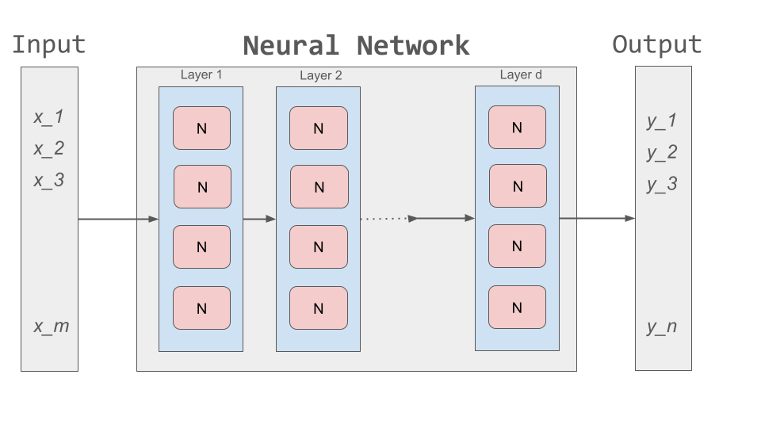
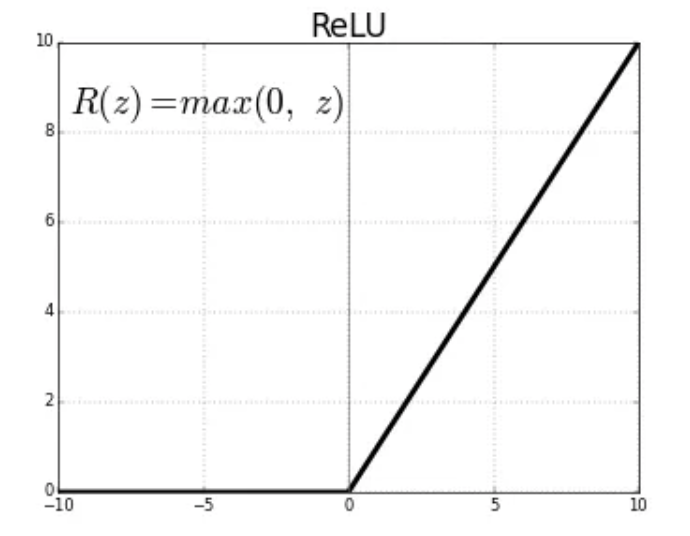
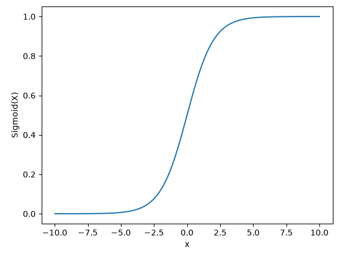

Introduction to Artificial Neural Networks and Deep Learning
============================================================

In this module we introduce the primary components of artificial neural networks (ANNs) 
and deep learning (DL), and we implement an initial ANN using the Keras API on the classic 
fashion MNIST dataset. Along the way, we introduce the concept of train-validation-test 
splits and techniques to ensure that a model learns generalizable patterns. 

By the end of this unit, students should be able to:

1. Explain the computation performed by one artificial neuron.
2. Describe how neurons are composed into dense layers.
3. Distinguish input, hidden, and output layers.
4. Explain the roles of activation, loss, and optimizer.
5. Distinguish training, validation, and test sets.
6. Build and train a dense Fashion-MNIST classifier in Keras.

Artificial Neurons and Artificial Neural Networks 
-------------------------------------------------

Machine Learning has been dominated by artificial neural networks (ANNs) and, in particular, deep neural 
networks (DNNs) over the last decade or so. The fundamental building block for ANNs is the *artificial neuron*, 
a mathematical function that looks very similar to the parameterized linear functions we looked 
at earlier, but it adds an *activation function* which is usually non-linear. The standard formula for 
an artificial neuron can be written vectors as follows: 

.. math:: 

    y = h (\sum_i w_i * x_i + b)

or in vector form:

.. math:: 

    y = h (w\cdot x + b)

where :math:`w` is a vector of *weights*, :math:`b` is called the *bias*, :math:`x = (x_1, ..., x_n)` is a 
vector of inputs, and :math:`h` is the activation function. 

We define the *input dimension* of the neuron to be the length of the input vector :math:`x`
(specified to be :math:`n` in the above).
On the other hand, the *output 
dimension* is always 1 because the output of a neuron is always a single real number. Moreover, the number of 
parameters of neuron (i.e., total number of weights plus the bias) is equal to 
one more than the input dimension. The bias allows the neuron to shift its response so as to not always be 
centered at zero. Conceptually, the weights determine how the inputs contribute to the result, 
while the bias determines the baseline level at which the neuron activates.

The parameters are adjusted during training. The activation function,
however, is chosen ahead of time by the model designer and therefore is fixed throughout training. Thus, it 
is referred to as a *hyperparameter*. 

An ANN then is composed of a series of layers of artificial neurons. Within the network, intermediate outputs 
produced by one layer are passed to the next layer as inputs before ultimately producing an output. The weights 
and biases of all the neurons in the network are collectively referred to as the *parameters* of the network. 
These are the values that get updated during training. 

    Architecture of an ANN. 

Activation Functions 
^^^^^^^^^^^^^^^^^^^^

Non-linear activation functions are crucial to ANNs because they allow the network to 
encode non-linear patterns or relationships across features. Historically, a number of different activation 
functions have been used. We'll introduce just one for now. 

The ``ReLU`` (Rectified Linear Unit) activation function
^^^^^^^^^^^^^^^^^^^^^^^^^^^^^^^^^^^^^^^^^^^^^^^^^^^^^^^^^
The Rectified Linear Unit function, referred to as "ReLU", is among the most popular and activation 
functions used today, particularly in the "hidden" layers (i.e., intermediate layers). 
It is used in almost all the Convolutional Neural Networks (CNNs) which we will introduce in the  
next lecture. 

The ReLU is defined as follows: 

.. math:: 

    f(x) = max(0, x) = \frac{ x + |x|} {2}

The range of the ReLU function is the Real interval :math:`[0, \infty]`.
Moreover, the function is zero when :math:`x` is less than zero and is equal to :math:`x` 
when :math:`x` is positive.

Dense Sequential Neural Networks 
^^^^^^^^^^^^^^^^^^^^^^^^^^^^^^^^

We can feed the outputs of one layer as inputs to the next layer in different configurations. 
In some sense, the simplest architecture is called a *sequential* neural network involving 
a linear stack of layers, where each intermediate layer connects to exactly one layer. 
We label the first layer the *input layer* since it is fed the input directly, while the last 
layer is labeled the *output layer*, since it produces the final output of the ANN. The 
layers in between are referred to as *hidden layers*. For example, an ANN with two 
hidden layers would have four layers in total and could be depicted like this: 

.. math:: 

    [
    \text{input}
    \longrightarrow
    \text{hidden layer}
    \longrightarrow
    \text{hidden layer}
    \longrightarrow
    \text{output layer}
    ]

When the output of every neuron in one layer is fed as the input to all neurons in the 
next layer, we say the network is *dense* or *fully connected*. Note that such an architecture imposes 
constrains on the input dimension of each neuron and the total number of neurons in a layer, since the 
total output dimension of a given layer is equal to the number of neurons in the layer. 
It follows that we must ensure that the input dimension of the neurons in a given hidden layer must 
equal the total number of neurons in the previous layer. 

Input Layer 
^^^^^^^^^^^

The input of an ANN has a fixed dimension corresponding to the number of features in the data. 
For example, in image classification problems, one option is to generate a flat, 1-dimensional array 
from the pixels associated with each image. If we have images of size 28x28, then the total 
number of pixels in each image will be 784. In this case, the input dimension will be 784. 

In general, the input layer of a dense ANN must have an input dimension equal to the input 
dimension of the dataset. That is, each neuron in the input layer will have an input dimension 
equal to the input dimension of the data set. 

Output Layer 
^^^^^^^^^^^^

The output layer needs to match the prediction problem, and, in particular, use the correct 
activation function so that the output can be interpreted as a prediction for the specific 
problem. 

For example, in a binary classification problem, we'd like the ANN to output a single probability
corresponding to whether the sample is in the class, while for a multi-class classification problem 
with :math:`K` distinct classes, the output layer would ideally produce :math:`K` scores, one for 
each class. These should be probabilities that the sample is in each class and thus should be 
non-negative and sum to 1. 

Use of the ``sigmoid`` activation 
function makes sense for binary classification problems, while use of ``softmax`` makes sense for 
multi-class classification, as we will explain. 

The ``sigmoid`` Activation Function
^^^^^^^^^^^^^^^^^^^^^^^^^^^^^^^^^^^
Mathematically, the ``sigmoid`` function is defined as:

.. math::

    f(z) =  \frac{\mathrm{1} }{\mathrm{1} + e^{-z}}

We can implement this in python as follows: 

.. code-block:: python3 

    import numpy as np

    def sigmoid(x):
        return 1.0 / (1 + np.exp(-x))

    # generate a plot --- 
    import matplotlib.pyplot as plt
    x = np.linspace(-10, 10, 100) 
    
    plt.plot(x, sigmoid(x)) 
    plt.xlabel("x") 
    plt.ylabel("Sigmoid(X)")     

Some important features of the signmoid are: 

1. It is differentiable everywhere and 
2. It maps almost all values to a value either very close to 0 or very close 1. 

Therefore, the outputs of a ``sigmoid`` can be interpreted as an 
estimated probability of membership in the class. Note that we still need to make use 
of a decision threshold to fully specify the classification. 

The Softmax Activation Function 
^^^^^^^^^^^^^^^^^^^^^^^^^^^^^^^^

The softmax function is particularly useful for multiclass classification problems because 
it takes an arbitrary vector of real numbers 
and converts it to a probability distribution over :math:`K` possible outcomes. You may see 
the term *logits* referring to the individual raw scores. 

The formula for ``softmax`` is given by: 

.. math:: 

    f(z)_i = \frac {e^{z_i}} {\sum_{j=1}^K e^{z_j} }

where :math:`K` is the length of the vector. You are not expected to memorize this formula, but you should
know that ``softmax`` should be used as the activation function in the output layer of an ANN being used 
for a multi-class classification problem. 

Training, Loss and Optimizers 
^^^^^^^^^^^^^^^^^^^^^^^^^^^^^

As we have mentioned previously, the goal with supervised learning is to discover values for the model's 
parameters that reduce loss on a portion of the dataset. 
Training repeatedly performs four main operations:

1. Make predictions with the current parameters.
2. Compare the predictions with the known targets.
3. Calculate how the parameters contributed to the loss.
4. Update the parameters in a direction expected to reduce future loss.

The loss function used to train an ANN needs to match the nature of the target being predicted and the 
activation function being used in the output layer. There is a fair amount one could say about loss 
functions, but for now, let us just summarize the most important loss functions for ANNs and when to 
use them: 

* Binary classification --- Binary cross-entropy loss function 
* Multi-class classification with one-hot encoding --- Categorical cross-entropy loss function 
* Multi-class classification with single integer encoding --- Sparse categorical cross-entropy loss function 
* Regression --- Mean squared error (MSE) 

How do we actually update the parameters once we have computed the loss? In short, we make use of an optimizer. 
Optimizers are algorithms or methods that are used to update the parameters of the neural network during 
training to minimize the loss function. Examples of optimizers include Adam (Adaptive Moment Estimation), 
Root Mean Squared Propagation (RMSProp), and 
Stochastic Gradient Descent (SGD). 
The details of how optimizers are implemented is beyond the scope for this course, but at a high level 
different algorithms make various trade-offs, such as convergence speed vs computational resources required. 
Commonly, Adam is often considered the best choice for ANNs, at least to start with.

ANNs in Keras: A First Look 
----------------------------

The Python Keras library provides a high-level API for building ANNs. It also provides APIs to support 
the entire ML lifecycle --- from data preprocessing to hyperparameter tuning and deployment. Historically, 
Keras was tied to the Tensorflow library, but version 3 of the library supports plugging various 
backends, including Tensorflow, PyTorch, and JAX. For illustrations in class, we'll use the Tensorflow 
backend, but switching is easy and requires no changes to the primary code. 

The core data structures of Keras are ``Models`` and ``Layers``. As we have seen, conceptually, a layer 
is just an input/output transformation; a model is a directed acyclic graph (DAG) of layers. 

The ``Sequential`` model class in Keras corresponds to a Sequential model, and the ``Dense`` layer 
class corresponds to a dense layer.

.. code-block:: python3 

    from keras.models import Sequential
    from keras.layers import Dense

    # instantiate the model object 
    model = Sequential()

    # add a single input layer, specifying the number of neurons, input dimension and activation function
    model.add(Dense(..., input_dim=..., activation='relu'))

MNIST Dataset 
^^^^^^^^^^^^^    

The original MNIST (Modified National Institute of Standards and Technology) dataset was
set of 28x28 grey scale images of hand-written digits that became a classical dataset 
for computer vision problems in machine learning. Once models were produced that were able 
to solve the original MNIST dataset, a second dataset, called Fashion-MNIST consisting of 
28x28 grey scale images of articles of clothing, was constructed as a more challenging version 
of the original MNIST. 

In the Fashion-MNIST dataset, there are 10 possible classes of clothing: 

1. T-shirt/top
2. Trouser
3. Pullover
4. Dress
5. Coat
6. Sandal
7. Shirt
8. Sneaker
9. Bag
10. Ankle boot

We'll illustrate the concepts above by building an ANN to do image classification for the Fashion-MNIST 
dataset. We can load the dataset directly from Tensorflow: 

.. code-block:: python3 

    from tensorflow.keras.datasets import fashion_mnist 

Train, Validation, and Test     
^^^^^^^^^^^^^^^^^^^^^^^^^^^

The goal with machine learning is to train a model that can 
infer patterns that generalize to new samples, not just the ones it has seen during training. 
the key question is not “how well did the model do on the training data?” but r
ather, “did the model learn a pattern that generalized to new samples?”

To ensure the models we build are truly learning patterns that generalize, we do not 
use the entire labeled dataset for training. Instead, we split the dataset up into 
three separate subsets, as follows: 

* Training data are used to update the model parameters
* Validation data are not used for parameter updates. They are used during development 
  to evaluate choices such as the network architecture and hyperparameters such as 
  learning rate and number of training epochs.
* Test data are held back for a final evaluation after the development choices have been made.

 we repeatedly evaluate the model on the test test, and we modify the system in response, 
 the test set has effectively become another validation set. **This is a cardinal sin in machine learning!** 
 A new, untouched evaluation set would then be needed for an unbiased final estimate.

 Tensorflow gives us a very convenient API for splitting datasets like Fashion-MNIST, but 
 note that the validation set will be split from the training set later. 

 .. code-block:: python3 

    (X_train, y_train), (X_test, y_test) = fashion_mnist.load_data()

Look at the shapes of each variable. How do you interpret them? 

.. code-block:: python3

    X_train.shape 
    --> (60000, 28, 28) 

    X_test.shape 
    --> (10000, 28, 28)

    y_train.shape 
    --> (60000, )

    y_test.shape 
    --> (10000,)

Hands-on: An ANN in Keras for Fashion-MNIST 
-------------------------------------------

Today, we'll build a fully connected ANN to try and classify the images in Fashion-MNIST. 
Each image contains 28x28=784 pixel values, and each pixel value is in the range 0 to 255, 
representing  the brightness or intensity of that pixel. 

For today's dense network, we will flatten each image into a vector of 784 values. 
Flattening preserves all the pixel values but discards the explicit two-dimensional 
organization of the image. On Thursday, this limitation will motivate convolutional neural networks.

We will also rescale the pixel intensities from integer values between 0 and 255 to floating-point 
values between 0 and 1. Rescaling does not add information, but it places the numerical inputs 
in a range that is generally easier to use during optimization.

Specify Model Architecture 
^^^^^^^^^^^^^^^^^^^^^^^^^^

Our initial network will have an input layer, a single "hidden" layer, and an output layer. 
We can use the ``Sequential`` class to specify the network structure as follows: 

.. code-block:: python3

    model = keras.Sequential([keras.Input(shape=(28, 28)), 
                              keras.layers.Rescaling(1 / 255.0), 
                              keras.layers.Flatten(), 
                              keras.layers.Dense(128, activation="relu"), 
                              keras.layers.Dense(10, activation="softmax"), 
                            ])

The code above creates an input layer that is rescaled and flattened, a single hidden layer 
with 128 neurons and the ReLU activation function, and a single output layer with 10 
neurons and softmax activation function. 

*Discussion.* Think about the importance of different values in the code above. What values are 
dictated by the problem itself (classification of Fashion-MNIST) and which values could we change? 
For example, is it required that the hidden layer have 128 neurons? What about the output layer? 

You can think of the ANN architecture as a sequence of transformations:

1. Accept a (28\times28) image.
2. Rescale its pixel values.
3. Flatten the image into 784 values.
4. Produce a learned hidden representation containing 128 values.
5. Produce probabilities for ten possible classes.

Compile the Model 
^^^^^^^^^^^^^^^^^

Once we have created the network we then use the ``compile()`` function to specify various 
aspects of training. Note that executing ``compile()`` doesn't actually train the model, it 
just prepares the model for training. 

The ``model.compile`` function accepts a number of arguments. We begin by 
introducing the following important arguments. For a complete list, see the Keras documentation for 
compile `here <https://www.tensorflow.org/api_docs/python/tf/keras/Model#compile>`_.

``optimizer``: This parameter specifies the optimizer to use during training. 
Examples values: ``adam``, ``rmsprop``, ``sgd``. 

``loss``: This parameter specifies the loss function to use during training. s.

.. code-block:: python3 

    model.compile(optimizer="adam", loss="sparse_categorical_crossentropy", metrics=["accuracy"], )

Train the Model 
^^^^^^^^^^^^^^^

Once we have our model constructed we are ready to train the model. We use the 
``fit()`` function which takes a number of 
arguments. We'll look at just a few of the more important ones here: 

* ``x`` and ``y`` -- The input and target data, respectively. A number of valid types can be passed here, 
  including numpy arrays, TensorFlow tensors, Pandas DataFrames, and others. 
* ``epochs`` -- The total number of complete passes over the entire training dataset that will be performed 
  during training.
* ``batch_size`` -- This is the number of samples per gradient to use before updating the model's 
  parameters (weights and biases). Smaller batch sizes require less computational resources, especially 
  memory, and can help with finding global maximum values but can also greatly increase the time required 
  for the model to converge. 

* ``validation_split`` -- The percentage, a a float, of the dataset to hold out for validation. Keras will
  compute the validation score at the end of each epoch. 
* ``verbose`` -- (0, 1, or 2). An integer controlling how much debug information is printed during training. 
  A value of 0 suppresses all messages. 

.. code-block:: python3 

    model.fit(X_train, y_train, validation_split=0.1, epochs=20, verbose=2)

Note that this will take some time to execute, on the order of a couple of minutes. The output should look 
similar to the following: 

.. code-block:: python3 

    Epoch 1/20
    1688/1688 - 7s - 4ms/step - accuracy: 0.8214 - loss: 0.5053 - val_accuracy: 0.8572 - val_loss: 0.4058
    Epoch 2/20
    1688/1688 - 5s - 3ms/step - accuracy: 0.8641 - loss: 0.3793 - val_accuracy: 0.8670 - val_loss: 0.3602
    Epoch 3/20
    1688/1688 - 5s - 3ms/step - accuracy: 0.8767 - loss: 0.3383 - val_accuracy: 0.8707 - val_loss: 0.3523
    Epoch 4/20
    1688/1688 - 5s - 3ms/step - accuracy: 0.8856 - loss: 0.3153 - val_accuracy: 0.8780 - val_loss: 0.3420
    Epoch 5/20
    1688/1688 - 4s - 2ms/step - accuracy: 0.8913 - loss: 0.2936 - val_accuracy: 0.8780 - val_loss: 0.3389

    . . . 

    Epoch 18/20
    1688/1688 - 3s - 2ms/step - accuracy: 0.9304 - loss: 0.1857 - val_accuracy: 0.8868 - val_loss: 0.3527
    Epoch 19/20
    1688/1688 - 3s - 2ms/step - accuracy: 0.9317 - loss: 0.1835 - val_accuracy: 0.8865 - val_loss: 0.3354
    Epoch 20/20
    1688/1688 - 4s - 2ms/step - accuracy: 0.9329 - loss: 0.1794 - val_accuracy: 0.8915 - val_loss: 0.3477

Evaluate the model on test data
^^^^^^^^^^^^^^^^^^^^^^^^^^^^^^^

Finally, once we have trained the model, we evaluate its performance on the held-out test set. 
We can do this using the ``evaluate()`` method.

.. code-block:: python3

    test_loss, test_accuracy = model.evaluate(X_test, y_test, verbose=0)
    print("Test Loss:", test_loss)
    print("Test Accuracy:", test_accuracy)

    Test Loss: 0.3642110824584961
    Test Accuracy: 0.8866000175476074

The output shows we achieved 88.6\% accuracy on the test set. That is quite good for our very first 
model, but we can do better. In the next lecture, we'll look at convolutional neural networks (CNNs), 
a different kind of ANN architecture that has excelled at computer vision problems like the 
Fashion-MNIST classification problem. 