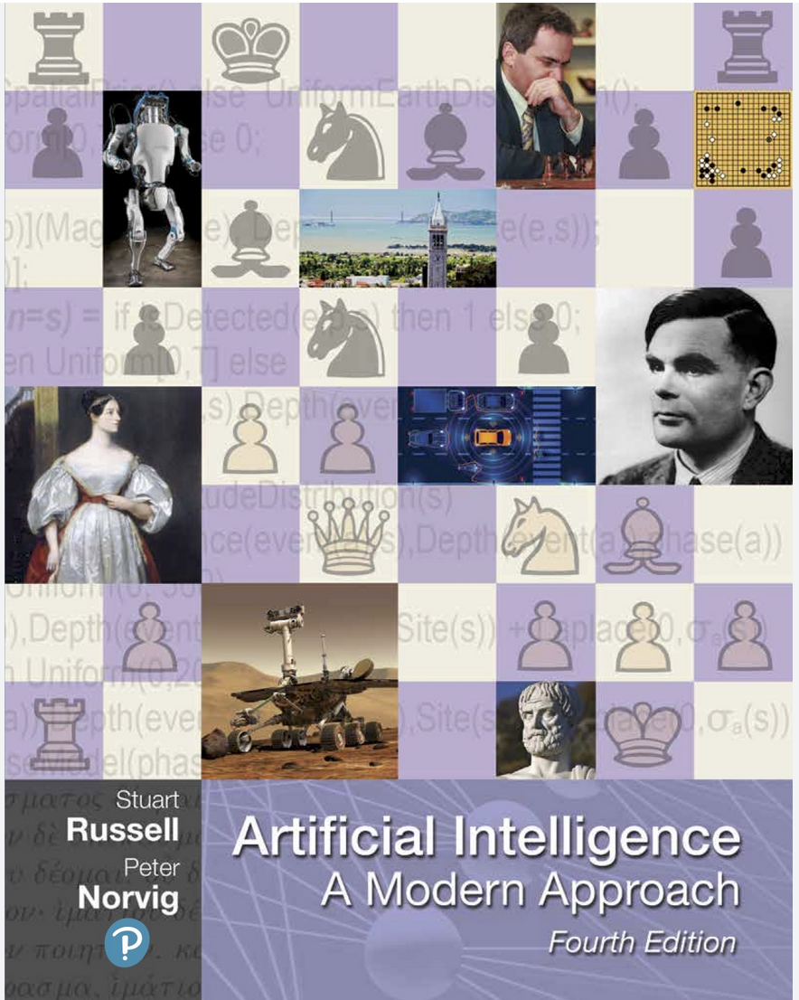

Class Introduction
==================

| **Welcome to:**
|
| COE 379L (16105): Software Design For Responsible Intelligent Systems, Fall 2026
|                   Responsible Intelligent Systems with Formal Guarantees
| Computational Engineering (COE) Program 
| Department of Aerospace Engineering and Engineering Mechanics
| The University of Texas at Austin

**Instructors:**

* Joe Stubbs, jstubbs@tacc.utexas.edu, ACB 2.246 (on Pickle Research Campus), ASE 5.224 (Main Campus)
* Anagha Jamthe, ajamthe@tacc.utexas.edu
* Walter Moreira, wmoreira@tacc.utexas.edu 

**Time:** Tues/Thur 11:00am - 12:30pm

**Location:** GDC 2.210

**Teaching Assistant:** Sichang Su (ss233865@eid.utexas.edu)

**TA Office Hours:** Monday from 9:30 a.m. to 12:00 p.m, ASE 3.112, desk 3.36.

**Important Links:**

* Lecture Notes: https://coe-379l-fa26.readthedocs.io/en/latest/
* Canvas: https://utexas.instructure.com/courses/1456157
* Slack: https://tacc-learn.slack.com/   #coe-379l-fa26 (channel)

From the Syllabus 
~~~~~~~~~~~~~~~~~

**Catalog Description:**

Covers design, implementation, operation and assurance of intelligent software systems based on data intensive 
artificial intelligence and machine learning techniques as well as verification of properties of such  
systems based on formal methods. Course materials and project assignments will 
utilize real-world datasets and examples from engineering disciplines.

**Prerequisites:**

Computational Engineering 332 with a grade of at least C-.

**Knowledge, Skills, and Abilities Students Should Have Before Entering This Course:**

This course assumes knowledge of the Python programming language (data structures, conditionals, 
loops, and functions), software design, distributed systems, and asynchronous programming (concurrent 
programming, tasks queues, microservice architectures, etc). We also assume knowledge of Multivariate 
Calculus and Linear Algebra as well as a basic, working knowledge of the Linux command line. We 
will not introduce or cover basic programming skills or debugging. Ultimately, each student is expected 
to be able to write and debug working Python programs and to have experience designing larger systems 
as a composition of smaller components. This is not an introductory programming class nor an introductory 
design class; we will not have time to help students debug their programs.

**Knowledge, Skills, and Abilities Students Gain from this Course (Learning Outcomes):**

The objective of this course is to introduce students to machine learning (ML) and formal methods (FM)
techniques for designing, implementing, validating and operating responsible intelligent systems.
The course covers algorithms, techniques and tools for applying ML and FM to problems in engineering, mathematics, 
computer science and related disciplines. The course emphasizes projects that allow students to design and 
implement responsible, intelligent computational systems. Unlike previous versions 
of the course, this year we will focus on designs and implementations of *neuro-symbolic* systems, that is, 
systems that combine AI/ML (and deep learning, specifically) with "symbolic" methods. These kinds of systems have
grown in popularity recently and have achieved breakthroughs in a number of different problem types and domains. 

**Class Format**

The class will be delivered in-person or following the guidance of the University of Texas. Class 
meetings will consist of lectures/demonstrations and hands-on labs. Students are expected to attend 
every lecture and actively participate in the hands-on portions during the class. In some cases, 
the hands-on portions will provide partial solutions to project assignments. Lecture materials 
with worked examples will be posted to the class website before the class meeting. 
Additionally, there will be a class Slack channel for discussing ideas about the course with 
your fellow students.

**Computer:**

The entire course will be computer based. The instructor will provide remote servers for students to 
work on. Students are expected to have access to a 
personal / lab computer with a web browser and a terminal and SSH/SCP client.
**On Thursday we will assign each of you a student VM.**

**Text:**
No textbook will be used for this course. However, we will provide materials for all lectures on the 
class website, and we will supplement them with additional reading materials available online. 

**Office Hours:**

Office hours will be for 1 hour immediately following the class and/or by appointment. We plan to 
use Slack for general communications and to help with the materials. https://tacc-learn.slack.com/

**Project Assignments**

There will be a single mid-term project that will cover topics presented in the course, and there will 
be a final project which is more open-ended. 
Each student must work alone on the mid-term project. On the final project, students will be 
allowed to work in groups; however, each student must have a well-defined role in the project and 
documented set of contributions. This is not dissimilar to how papers with multiple authors must 
declare the contributions of each co-author; see, for example, the `CRediT (Contributor Roles Taxonomy)
System <https://www.elsevier.com/researcher/author/policies-and-guidelines/credit-author-statement>`_. 

**Attendance and Quizzes**

Regular attendance is expected. Starting in week 2, we will conduct mini “quizzes” during some classes 
via UT Canvas. We will not announce the exact date and time of the quizzes in advance, but there will be 
a total of 15 quizzes (on average, a little more 1 per week).
These will be short with a small number of questions based on the content covered in recent lectures 
and/or readings. No “make up” quizzes will be offered, but the lowest 5 quiz grades will be dropped. 
For extenuating circumstances, such as a serious illness requiring the student to miss multiple weeks of 
classes, we will work out an arrangement on a case by case basis. 

**Grading**

The grade for the course will be based on the quizzes, exam, and project grades, as follows:

* Quizzes (Best 10) - 35%
* Mid-term Project - 25% (Individual project)
* Final Project    - 40% (Individual or groups)

**Other Administrative Matters**

DISABILITY & ACCESS (D&A)
The university is committed to creating an accessible and inclusive learning environment consistent 
with university policy and federal and state law. Please let me know if you experience any 
barriers to learning so I can work with you to ensure you have equal opportunity to participate 
fully in this course. If you are a student with a disability, or think you may have a disability, 
and need accommodations please contact Disability & Access (D&A). Please refer to the D&A website 
for more information: http://diversity.utexas.edu/disability/. If you are already registered with 
D&A, please deliver your Accommodation Letter to me as early as possible in the semester so we 
can discuss your approved accommodations and needs in this course.

Special Notes:
The University of Texas at Austin provides upon request appropriate academic adjustments for 
qualified students with disabilities. For more information, contact the Office of the Dean of 
Students at 471-6259, 471-4641 TDD or the Cockrell School of Engineering Director of Students with 
Disabilities at 471-4321.

Evaluation:
Note that the Measurement and Evaluation Center forms for the Cockrell School of Engineering will 
be used during the last week of class to evaluate the course and the instructor. They will be 
conducted in an electronic format for Fall 2025. You may also want to note any other methods of 
evaluation you plan to employ.

**Using Artificial Intelligence for Class**

Artificial intelligence systems like Claude Code and ChatGPT have become powerful tools for many tasks.
These existing tools have both appropriate and inappropriate uses in classwork just as in the "real world".
Learning how best to use these tools is very important. At the same time, learning foundational concepts and 
ideas remains essential, not least of which because AI tools are fallible, and often times, 
identifying their mistakes requires expertise.
In this class, we are learning how to design large systems with AI. It is an opportunity for 
you to learn fundamental concepts that will be useful to you throughout your life. 

For these reasons, the use of artificial intelligence tools in this class shall be **prohibited** on 
some assignments and **permitted with some limits** on others. 
On the mini-quizzes, **no AI tools will be allowed.** We want to give you 
an incentive to learn the fundamental ideas and to not rely exclusively on AI. Similarly, on 
Project 1, you may use AI tools to help you with conceptual aspects of the project, but you
**cannot use AI tools to generate any code for Project 1.** On the final project, you will be 
able to use AI tools at your discretion for any aspects of the project except the final written 
report, but you will be **responsible for anything you submit.** 

On the other hand, using AI tools to help you understand concepts, brainstorm ideas for 
projects, or study for an exam are excellent uses. We highly recommend you look into the 
`UT AI Initiative <https://tech.utexas.edu/initiatives/artificial-intelligence>`_ that provides 
free access to various AI tools.

.. warning:: 

  Using AI tools without permission or against stated policy for a quiz or project 
  constitutes a violation of UT Austin’s Institutional Rules on academic integrity.

Software Design for Responsible Intelligent Systems 
~~~~~~~~~~~~~~~~~~~~~~~~~~~~~~~~~~~~~~~~~~~~~~~~~~~~

In COE 332, we cover software system design concepts for systems that can perform non-trivial 
computational analysis, but we do not treat the subject of computational data analysis itself. 

In this course, we are going to cover architectures and techniques for building applications that leverage
both artificial intelligence (AI) and formal methods (FM). Everything (pretty much) that we learned 
in 332 will be used in this class -- for example, Python programming, types and modeling using JSON, Pydantic, 
etc., web-based APIs, software engineering concepts (modularity, cohesion, coupling, testing), dependency 
management and packaging, etc. 

We'll assume you know the topics we covered in COE 332, for example:

* Python programming and best practices with respect to code organization within a repo. 
* How to commit and work with code in a git repository. 
* How to install a package; how to build a Docker image with a package installed. 
* How to read the documentation for a package and use it in your code. 
* The basics of HTTP, Docker, flask (for building web APIs) 

If you have not taken COE 332, we **encourage** you to use the `COE 332 materials <https://coe-332-sp26.readthedocs.org>`_ to learn any of the above topics 
that you are not familiar with. 

What is Artificial Intelligence and Machine Learning?
-----------------------------------------------------

Today, many people conflate the term *artificial intelligence* with 
*"data-driven, probabilistic machine learning"*, i.e., systems that learn patterns purely from data. 

However, for many decades AI meant something much more. 
The birth of the term *artificial intelligence* could be traced back to a summer workshop
held at Dartmouth college in 1956, the "Dartmouth Summer Research Project on Artificial Intelligence". 
(Or perhaps even earlier, for example, to as early as 1940, with efforts at places such as MIT and CMU.) 

The proposal for the 1956 Dartmouth Workshop states: 

   *The study is to proceed on the basis of the conjecture that every aspect of learning or any other 
   feature of intelligence can in principle be so precisely described that a machine can be made to simulate it.*

Many may be surprised to learn that one of the highlights of the workshop was a program called 
"Logic Theorist", largely considered to be the first AI program. Logic Theorist was an early 
automated theorem prover! And in fact, it was a successful one: not only did it 38 of the first 52 theorems from 
Whitehead and Russell’s famous *Principia Mathematica*, but it even found a more elegant proof 
of one of the theorems. And, as part of impllementing Locif Theorist, its authors gave one of the first 
implementations of *heuristic search*, which would go on to be a foundational pillar of AI for decades. 

If we look back even just a couple of decades, we see that the field of Artificial Intelligence had already 
grown into a huge field and encompassed techniques from logic, probability, perception, reasoning, and learning.

Indeed, many consider the book *Artificial Intelligence: A Modern Approach* by Stuart Russell of UC Berkeley 
and Peter Norvig (previously, Director of Research at Google), to be the definitive text on AI. 
It's topics include: 

* Search Algorithms 
* Intelligent Agents 
* Logical Agents and First Order Logic, 
* Knowledge Representation (ontologies) and Reasoning (constraint satisfaction problems, logical agents)
* Automated Planning 
* Uncertainty, Probabilistic Reasoning, and Probabilistic Programming
* Multi-agent Decision Making 
* Machine Learning
* Deep Learning
* Robotics 

    Cover of the textbook Artificial Intelligence: A Modern Approach [1]; considered by many to be the definitive resource. The first edition was published in 1995.

However, in the last decade or so, the Machine Learning (and especially Deep Learning) subfield within AI 
has made significant breakthroughs, leading some to conflate the term AI with ML. 

What is Machine Learning?
-------------------------

Machine Learning (ML) is the subfield of AI that develops algorithms to analyze and infer patterns in *data*.

Here, **data** is the key word. Instead of using logic, or a search technique, or a formal knowledge
representation, ML looks for patterns in exsiting data sets and attempts to apply those patterns to 
future data. 

Why is Machine Learning having so much success *now*? Two primary reasons: 

1. There is an abundance of data, thanks to the internet, automation and IoT devices. 
2. Computing power has continued to increase so that algorithms that were not tractable a decade ago 
   can now complete in a relatively short amount of time. 

And as a result, we are seeing applications of ML to virtually all fields, including: 

* Computational Biology and health informatics (e.g., predicting diabetes)
* Structural/Civil Engineering (e.g., classifying damage to buildings)
* Traditional IT (e.g., spam email classification)

And many more. 

But at the same time, Formal Methods have been enjoying a kind of resurgence of their own, 
and today, some of the most powerful AI systems combine ML and FM. 

What Are Formal Methods 
-----------------------

Put simply, Formal Methods (FM) are the use of mathematical logic and rigorous computer science models to 
**prove** that software or hardware is free of bugs. Here is the definition from Wikipedia:

   *In computer science, formal methods are mathematically rigorous techniques for the 
   specification, development, analysis, and verification of software and hardware systems.* [2]

As mentioned, FM was originally part of AI, but it split out into its own subfield in the 1970s and 1980s 
when it became apparent that there were many applications to software and hardware engineering. 

We can think of FM as involving three components: 

1. *Specification* --- mathematical definition of what should be true (e.g., what the system should do)
2. *Mathematical model* --- The actual code, hardware design, protocol, etc., translated into mathematical logic. 
3. *Formal verification* --- Automated and interactive tools (model checkers, solvers, provers) that 
   mathematically prove that the model always satisfied the specification. 

How do computer programs verify mathematical theorems? A key insight is the Curry-Howard Isomorphism
or Curry-Howard Correspondence, which establishes a direct connection between mathematical logic 
and typed functional programming languages. Specifically, Curry-Howard establishes the following:

* Propositions are types --- Propositional statements (or theorem statements) are equivalent to types 
  in a functional programming language.
* Proofs are progrmans --- constructing a proof of a propositional statement is equivalent to constructing 
  a program that inhabits the type (corresponding to the statement). 
* Verification is type checking --- Checking whether a proof is correct is equivalent to checking 
  whether a program (the proof) has the correct type (the proposition). 

As mentioned, FM has enjoyed has enjoyed its own renaissance over the last decade thanks in large part to two 
major efforts. First, the formalization of theoretical disciplines including mathematics surged in popularity 
through efforts made by the Lean theorem prover community. Its open source project Mathlib grew to millions 
of lines of code and formalized a significant portion of undergraduate and graduate mathematics and even some 
research mathematics. This was a huge shift from the historical view that formal verification was 
too cumbersome to be useful for mathematics. At this point, some of the most prominent mathematicians such as 
Fields Medalists Terence Tao and Peter Scholze have actively adopted and championed Lean.

Second, major AI labs like Google DeepMind began to realize that FM tools (like Lean) could be combined 
with AI to achieve powerful results. A landmark achievement occurred in July, 2024, when DeepMind's AlphaProof 
achieved a silver medal at the International Mathematical Olympiad. AlphaProof's training process relied on 
an automated feedback loop that leveraged Lean to check whether proof candidates were correct. 

What We'll Do This Semester 
----------------------------

As we have mentioned, this semester we will study design and techniques for hybrid AI-FM systems, 
sometimes called *neuro-symbolic*  systems. We will put an emphasis on algorithms, architectures, 
and applications (including applications to theoretical fields, such as mathematics, as well as to 
applied fields such as engineering). 
At the same time, due to time constraints, we will be forced to deemphasize or skip altogether material 
related to foundational model training, theoretical foundations of ML/DL, and ML Ops. Additionally, we will 
provide a gentle introduction to FM that will avoid much of the heavy theoretical material and should be 
accessible to engineers without a substantial theory background. 

Class Schedule 
--------------

**Class Schedule (approximate, subject to change)**

Part 1: AI, RAG and Agentic Systems

* Week 1 (Aug 25, 27): Course intro, TACC VM and software, Supervised Learning and ANNs
* Week 2 (Sep 1, 3): Intro to Deep Learning with Keras, DNN Architectures for different tasks, Image Classification with CNNs
* Week 3 (Sep 8, 10): Intro to Transformers, Modern Foundation Models, AI inference over HTTP
* Week 4 (Sep 15, 17): Retrieval Augmented Generation, Parsing, Search Algorithms
* Week 5 (Sep 22, 24): Failure modes and Benchmarks 
* Week 6 (Sep 29, Oct 1): Introduction to Agentic Architectures 
* Week 7 (Oct 6, 8): Engineering Agents, Formal Methods Motivation

Part 2: Introduction to Formal Methods 

* Week 8 (Oct 13, 15): Overview of Formal Methods in Lean – Specifications, Predicates, and Finite-State Machines.
* Week 9 (Oct 20, 22): Type theory foundations, Curry-Howard Isomorphism, Basic Syntax in Lean (Definitions, Theorems, Tactics)
* Week 10 (Oct 27, 29): Lean Continued (variables and basic types, computable and noncomputable functions, basic data structures)

Part 3: Patterns and Architecture for Neurosymbolic Systems 

* Week 11 (Nov 3, 5): RAG with Formal Verification of Evidence
* Week 12 (Nov 10, 12): Agentic Systems with Safe Tool Calling 
* Week 13 (Nov 17, 19): Formally Verified Mathematics – OEIS and Integer Sequences as Lean functions, Proving Value Theorems, Proving Equivalences, Autoformalization 
* Week of Nov 23 -- **Thanksgiving Break, no class this week**
* Week 14 (Dec 1, 3): Special topics, including Retrieval for Lean libraries; Tactic programming and other metaprogramming in Lean; More on formally verified mathematics or other topics. 

Active TACC Account Required 
----------------------------- 

**Before We Leave Class**

1. Make sure you have an **active** TACC account and MFA pairing. You can check the status of your account be 
logging into the TACC User portal: https://portal.tacc.utexas.edu/

* Go to the Account Profile (https://tacc.utexas.edu/portal/account) 
* If you need help with your account you can submit a ticket: https://tacc.utexas.edu/portal/tickets

2. Add your TACC account username to the Google doc spreadsheet shared in class. 

3. Send an email to myself, Anagha, Walter, and Sichang. (Email addresses are listed below)
   Include the following:

.. code-block:: bash 

    To: jstubbs, ajamthe, wmoreira @ tacc.utexas.edu; ss233865@eid.utexas.edu
    Subject: COE 379L
    Body: 
    Please include the following: 
      1) Name
      2) TACC username 
      3) EID 
      4) What do you want to get out of this class?

We will have VMs created for each person enrolled. 

For Next Class and Future Classes
~~~~~~~~~~~~~~~~~~~~~~~~~~~~~~~~~

When showing code, I will be using the
VSCode IDE in class (we used this in 332 last Spring). We recommend you install VSCode on your 
laptop and use the RemoteSSH extension. 

Here are instructions for installing VSCode: 

 * Linux -- Follow the instructions `here. <https://code.visualstudio.com/docs/setup/linux>`_
 * Mac -- Follow the instructions `here. <https://code.visualstudio.com/docs/setup/mac>`_
 * Windows -- Follow the instructions `here. <https://code.visualstudio.com/docs/setup/windows>`_

Note that you only need to follow the first step to install the actual VSCode application. 
Then, install the RemoteSSH (from Microsoft) extension.        

Bring your laptop computer to class for each lecture. 

Next time, we will make sure everyone can connect to their student VM. 

Student Responses: Goals for the Course 
~~~~~~~~~~~~~~~~~~~~~~~~~~~~~~~~~~~~~~~

We'll update this section with responses from the class. 

References and Additional Resources
~~~~~~~~~~~~~~~~~~~~~~~~~~~~~~~~~~~
1. Russell, Stuart J., Peter. Norvig. Artificial Intelligence: A Modern Approach (4th edition). Pearson 2020, ISBN 9780134610993 .
2. Formal Methods. Wikipedia. https://en.wikipedia.org/wiki/Formal_methods   
