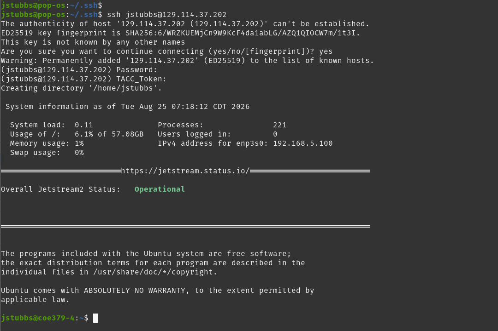
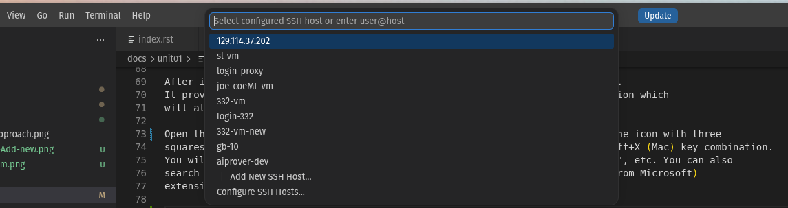
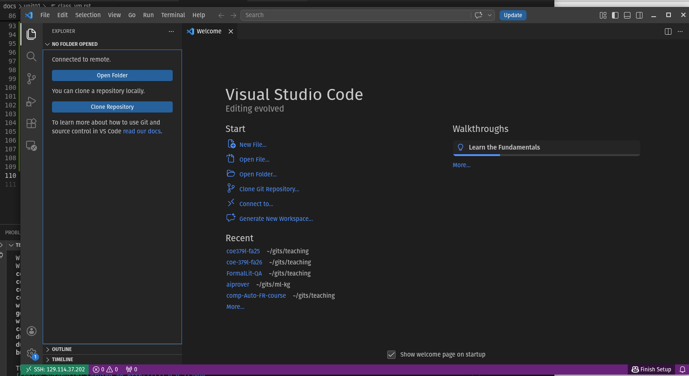

Using Your Class Virtual Machine 
=================================

Every student in the class will have their own virtual machine (VM) to do work. We highly recommend 
that you use your class VM to work on the in-class exercises and take-home projects. The VMs have 
the Linux OS and and other software installed for you that will make getting started easier. Also, 
we (the teaching staff) have access to all of the VMs and can help you in case something goes 
very wrong. 

SSH Access To Your VM
----------------------
Once you have provided the instructors with your TACC account and your VM has been created, 
you can ssh to it using its IP address and your TACC credentials. Make sure you are able to 
SSH to your VM using your TACC username, password, and MFA token.

.. code-block:: console

    [local]$ ssh <yout_tacc_username>@<your_IP_address>
    (username@your_IP_address) Password: 
    (username@your_IP_address) TACC_Token: 

    System information as of Tue Aug 25 07:18:12 CDT 2026
    . . . 

You should see an output similar to the below 

    Establishing an SSH session with your TACC VM. 

Working With VSCode and the VM
------------------------------

We will be writing code in VSCode this semester, a modern Interactive Development 
Environment (IDE) with many advanced features for software engineering such as 
syntax highlighting, code completion and interactive debugging. 
Our setup will involve having VSCode running on your local laptop while all the 
actual code we write and execute will run on your dedicated VM. In this setup, 
you can think of VSCode somewhat like a "web browser" with the actual source code living 
on the VM.

There are a few advantages to this approach, including: 

 1) Your code can be accessed remotely from different computers, and different individuals 
    can access the running code (including the instructors and TAs, who can help troubleshoot issues); 
 2) All students code will execute in the same environment (Linux OS with the same CPU cores and memory, 
    etc.)

Installing VSCode on Your Laptop
--------------------------------
Hopefully everyone had a chance to install VSCode onto their computer last time. If not, here are instructions again,
for Windows, Mac, and Linux:

 * Linux -- Follow the instructions `here. <https://code.visualstudio.com/docs/setup/linux>`_
 * Mac -- Follow the instructions `here. <https://code.visualstudio.com/docs/setup/mac>`_
 * Windows -- Follow the instructions `here. <https://code.visualstudio.com/docs/setup/windows>`_

Remember, you only need to follow the first step to install the actual VSCode application. 

Installing the Remote-SSH VSCode Extension
^^^^^^^^^^^^^^^^^^^^^^^^^^^^^^^^^^^^^^^^^
After installing VSCode, you will also want to install the RemoteSSH extension. 
It provides support for developing code on remote servers using an SSH connection which 
will allow you to work with code and processes running on your TACC VM. 

Open the Extensions view by either clicking Extensions from the left navbar (the icon with three 
squares and a diamond) or by using the Ctrl+Shift+X (Linux/Windows) or Cmd+Shift+X (Mac) key combination. 
You will see the extensions organized into listed of "Installed", "Recommended", etc. You can also 
search for extensions by typing into the search box. Install the Remote-SSH (from Microsoft) 
extension. 

Using Remote-SSH 
^^^^^^^^^^^^^^^^^
To use Remote-SSH from within VSCode, do the following steps: 

First, add a new host to your config using Command Palette (Ctrl+Shift+P) -> Remote-SSH: Connect to Host 
-> Add New SSH Host 

    Adding your TACC VM to your SSH config

Enter the full ``<tacc_username>@<your_IP_address>`` into the box to add your VM as a host. You only need 
to add the VM once. 

Once your VM has been added you should be able to connect to it using Command Palette (Ctrl+Shift+P) -> R
emote-SSH: Connect to Host  -> <your IP>. 

This will open a **new VMCode window** where you will be prompted for your password in the command palette 
box. Type your password and press enter and then type your MFA code and press enter. 

.. note::

   THe first time you connect it may take some time to transfer the necessary files to and from the 
   remote host. 

Once connected in the second window, click the File Browser tab (a set of "papers" icon, top left). If 
all went well you should see a message that you are "Connected to remote", like this:

    Connecting to the remote file system with Remote-SSH. 

Click "Open Folder" and then select your Linux home directory (i.e., ``/home/<username>``) in the 
command palette box to open that folder. Click "trust the authors" when prompted. 