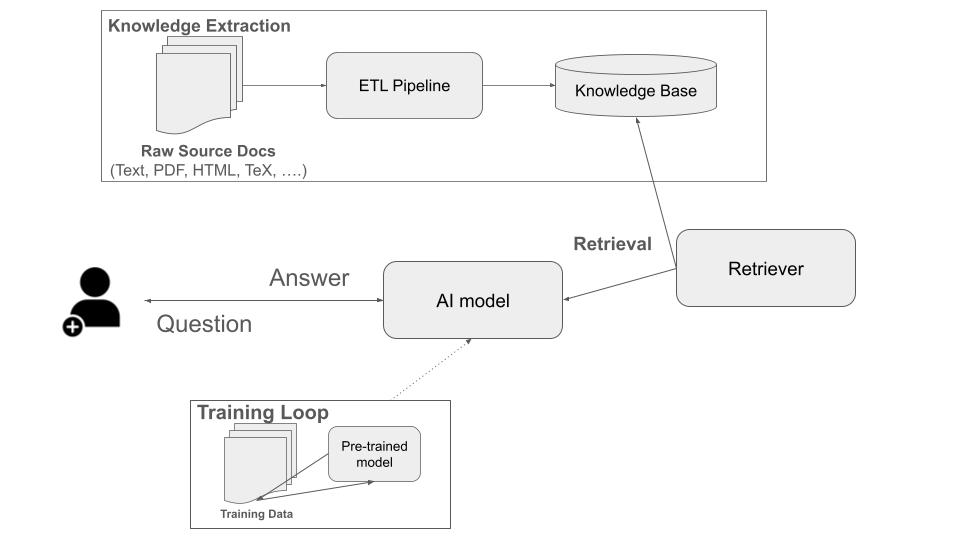

Introduction to Retrieval Augmented Generation (RAG) and Structured Knowledge Pipelines
========================================================================================

By the end of this module, students should be able to: 

* explain why retrieval is useful even when using large foundation models 
* identify the major stages of a RAG pipeline 
* explain why provenance must be maintained through the ETL process 
* understand the Formal-Lit-QA problem statement and desired system behavior. 

Motivation for Retrieval Augmented Generation 
---------------------------------------------

Recall from the previous week we established the following about foundation models: 

1. A foundation model generates from its parameters and current context. 
2. Its parameters are not like a database of facts, and the responses they produce are unreliable.

We will use retrieval to complement the model with the following: 

* information absent from model training
* information that changes over time
* private or domain-specific information
* evidence that users must be able to inspect

The goal with RAG is to provide high-quality evidence to the model. It does not:

* change the models weights 
* guarantee that the model will use the supplied evidence correctly

The Basic RAG Pipeline 
----------------------

Broadly, RAG is comprised of two separate phases: Ingestion and Retrieval. 

Ingestion 
^^^^^^^^^
During ingestion, source documents of various kinds are processed into a structured knowledge database. 
The high-level algorithm is as follows: 

.. math:: 

    \text{documents}
    \rightarrow
    \text{extraction}
    \rightarrow
    \text{transformation}
    \rightarrow
    \text{chunks}
    \rightarrow
    \text{index}

Here, the ultimate goal is an *index*, i.e., a datastructure of knowledge that supports efficient search.

Retrieval 
^^^^^^^^^^

When developing an AI application that processes a user's input, we leverage the pre-built index from the 
previous phase on each request. The high-level algorithm can be depicted as follows: 

.. math:: 

    \text{question}
    \rightarrow
    \text{retrieval}
    \rightarrow
    \text{selected chunks}
    \rightarrow
    \text{prompt}
    \rightarrow
    \text{answer}

ETL for Knowledge Extraction 
-----------------------------
Extract-Transform-Load (ETL) is a common paradigm in data science and machine learning to generate a centralized 
repository of refined data from disparate sources. It defines three primary steps: 

* *Extract* --- read in raw text, tables, metadata and other data from various sources. 
* *Transform* --- clean and normalize the extracted content into a common set of data structures. 
* *Load* --- place the resulting records into a searchable index. 

An important aspect of ETL is that preserves and even enhances the meaningful structures in the source documents. 
For example, an ETL pipeline might preserve section headings, paragraph boundaries, tables and figures, 
version information, sources and their identifiers, etc. 

Chunks, Metadata, Relations, and Provenance 
--------------------------------------------
A standard technique involves *chunking*, that is, creating individual records of content of different types. 
By breaking up larger documents into chunks, the resulting knowledge base contains focused records with 
specific content that can be fetched when needed. 

What exactly to include in an individual chunk including how large to make it is an engineering design choice 
that comes with tradeoffs. For example: 

* very small chunks may lose too much surrounding context to be meaningful or informative. 
* very large chunks may contain excessive, redundant or irrelevant material. 
* overlapping chunks can provide continuity but also introduce redundancy/duplication. 

As always in software engineering, understanding the application's requirements is essential for 
making a good design choice. Some requirement types and implications include: 

* How large is the context window for the LLM? How many retrieved chunks can we fit into the window? 
* For the given corpus of documents, what chunk size would result in chunks with 

*Provenance* in this context is the relationship between a passage or chunk and its original source. 

Formal-Lit-QA: A First Look 
----------------------------

We will motivate and illustrate the concepts of the next several lectures with a specific system which 
we will refer to as Formal-Lit-QA, for formal literature question answer. The goal for the system is 
to allow users to ask questions about a highly specialized research domain, and one that is constantly 
evolving with new papers. 

We can define the system's task precisely as follows: 

    *Given a question and a specified literature corpus, the system should produce an answer supported by passages 
    from that corpus, cite the supporting passages, and indicate when the corpus does not contain 
    sufficient evidence.*

We will use structured responses that distinguish four different types of outputs from the system: 

1. the answer, as a set of *claims*
2. the retrieved evidence, as a set of *chunks*
3. for each chunk, a structured reference to the index which ultimately maps back to a citation in the corpus. 
4. an indication of whether insufficient evidence was found to answer the question. 

In the following diagram, three distinct phases are depicted: 1) the training phase, which results in a 
trained model that can be deployed and used for inference; 2) the knowledge extraction pipeline, which 
results in a knowledge base which can be searched efficiently; and 3) the Question-Answer runtime, which 
leverages the trained model and a retriever. The retriever retrieves relevant facts from the index and 
the application loads them into the prompt before returning the generated response to the user. 

    An initial architecture
