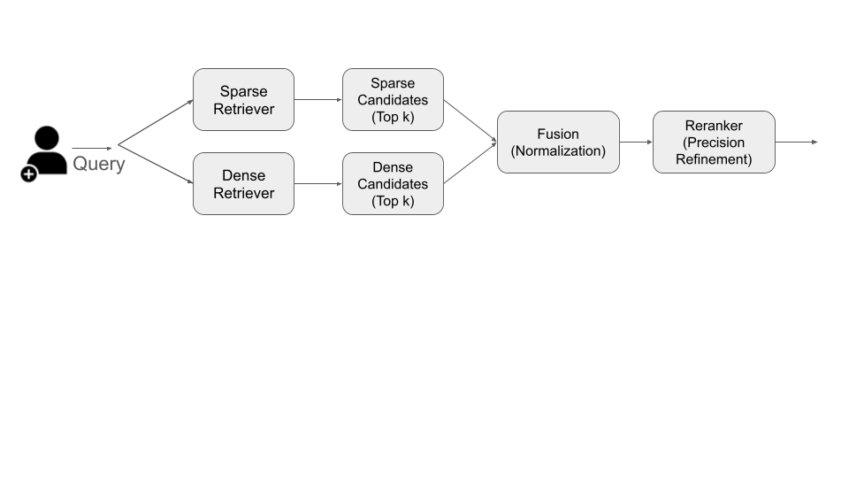

RAG Engineering
===============

By the end of this module, students should be able to: 

* explain why different file formats require different extraction strategies. 
* map heterogeneous documents into a common structured schema. 
* describe lexical and dense retrieval and their differences. 
* identify cases where each of lexical and dense retrieval are likely to succeed and where they 
  are likely to fail. 
* describe a basic hybrid retrieval algorithm at a high level  

Document Parsing 
----------------
The goal with parsing is to construct a generic abstraction that can be used for a wide variety of 
sources. Example source types and formats include: PDF documents, HTML documents, Markdown, TeX. 
A key goal is that the parser must be *layout aware* so as to preserve the meaningful structures 
in the source documents. 
Each of these different types presents complexities that the parser must be aware of: 

* PDF files store content layout rather than logical reading order. 
* HTML files contain navigation and presentation elements. 
* Markdown and TeX contain explicit structure but the parser must be aware of their individual syntax/grammar. 
* If working with hand-written documents that have been scanned, parsing may involve optical character recognition (OCR). 
* All of the above types may include tables, equations, figures, footnotes, etc. requiring special treatment. 

Building a production-grade parser that supports multiple formats is a massive effort, and there are many high-quality 
open source projects one can leverage, such as: 

* Docling --- https://github.com/docling-project/docling 
* Apache Tika --- https://tika.apache.org/ 

There are also open-source projects that focus on specific document types. For example, for TeX/LaTeX, we have 

* LaTeXML --- https://math.nist.gov/~BMiller/LaTeXML/
* pylatexen --- https://github.com/phfaist/pylatexenc 

Lexical or Sparse Retrieval 
----------------------------

Lexical retrieval is a search method that matches queries to documents using tokens or keywords. The term 
*sparse* here refers to the fact that the documents are mapped into a very high dimensional vector space 
where each token in the vocabulary corresponds to a dimension. For example, if there are 100,000 tokens 
in the vocabulary, then a document chunk will correspond to a vector of length 100,000 where all entries 
are 0 except for the ones corresponding to tokens that appear in the document. You can think of lexical 
retrieval as using the output of a tokenizer. 

In lexical retrieval, term weighting is an important aspect. Historically, algorithms weighted terms 
based on how frequently they appear in a given chunk and were penalized based on how frequently they 
appeared across the entire corpus. 

BM-25 (Best Match 25), arguably the most commonly used lexical algorithm currently, adds a *term frequency saturation* 
to prevent very common words from dominating the score. It also leverages *document length normalization* to 
penalize longer documents.  

To make lexical retrieval go fast, an *inverted index* is typically used. The idea is that since each document 
or chunk contains a relatively small number of tokens, the system maintains a lookup table of keywords -> documents. 

Strengths of Lexical Retrieval: 

* very efficient --- Such systems can achieve sub-millisecond retrieval speeds across billions of documents 
  because the engine only evaluates documents that contain at least one query term.
* transparency --- Matches are computed directly based on token keywords making the algorithm very transparent. 
* Works well with identifiers and other "meaningless" tokens --- Given an id, like a UUID, that has no semantic 
  meaning, a lexical retrieval mechanism can still find related documents. 

Weaknesses: 

* poor performance on synonyms --- If the corpus uses one term but the search includes a synonym, the retrieval will fail to 
  match the documents to the query. 
* limited semantic matching --- By its nature, a sparse retrieval algorithm does not learn semantic meaning of the 
  documents. 

Dense Retrieval 
---------------

By contrast, a dense retriever leverages a dense language embedding. You can think of the language embedding component 
from the transformer module. Every document or chunk is first mapped into an embedding space. 

Then, to perform a match against a query, the dense retriever first maps the query into the embedding space. 
It then scores the chunks by computing the similarity of the embedded query vector against the embedded 
chunk vectors (for example, cosine similarity). 

Strengths:

* Good at semantic similarity matching 
* Good with synonyms and/or passages that use slightly different wording 
* Can deal spelling mistakes and other typos 

Weaknesses:

* Can fail to match with "meaningless" identifiers
* Opaqueness --- Results are harder to interpret 
* Development complexity --- Embedding models must be trained, which can be expensive, and even worse, must be retrained if the 
  corpus changes significantly. 
* The overall performance of search tends to be slower and more computationally expensive that lexical retrieval. 

Hybrid Retrieval 
----------------

Modern RAG systems often leverage a hybrid retrieval system that conducts both a sparse and a dense search in 
parallel, followed by a fusion step to combine the two result lists into a single list, and finally a 
reranker applies a more expensive relevance model to the 

    An initial architecture
