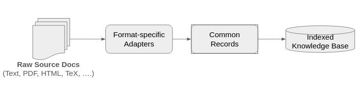

RAG Engineering
===============

The previous module introduced the two end-to-end subsystems with RAG -- *ingestion* and *retrieval*. 
This module takes a deeper dive at the engineering decisions that go into each subsystem. 
We will look at concrete implementations for how heterogeneous sources become a common record format, how several
retrieval methods produce ranked candidates, how ranked lists can be combined, and how retrieval can
be evaluated independently of answer generation.

By the end of this module, students should be able to:

* explain why different source formats require different extraction strategies
* map heterogeneous documents into a common, provenance-preserving chunk schema
* describe lexical, dense, and hybrid retrieval and their tradeoffs
* implement reciprocal-rank fusion over two ranked result lists
* distinguish candidate retrieval from reranking and context construction
* calculate ``Recall@k`` and reciprocal rank for a small retrieval benchmark

Parsing Documents into Structured Records
-----------------------------------------

Recall that the goal with the ingestion phase is to parse source documents of various kinds into a 
structured knowledge base. Ideally, ingestion would leverage a generic abstraction that can be used 
for a wide variety of source document types. The retriever and the question-answering layers of the 
application would not need to be concerned with different source document types. 

A common architecture therefore uses a family of
source adapters followed by a shared intermediate representation:

    RAG ingestion architecture

Also, as we mentioned last time, the source adapters should preserve meaningful structure in the 
original documents. Different formats use different methods for encoding structure, which 
present different challenges:

* PDF stores positioned layout elements, so extracted text may have incorrect reading order, missing
  columns, or detached captions.
* HTML contains semantic content alongside navigation, advertisements, scripts, and presentation
  elements.
* Markdown and TeX expose structure explicitly, but their syntax is complex and must be parsed using a parser 
  rather than removed with a few heuristics (e.g., regular expressions).
* Scanned, hand-written documents require optical character recognition (OCR), which introduces recognition errors
  and may require layout analysis.
* Tables, equations, figures, footnotes, and code blocks may require representations different from
  ordinary paragraphs.

Production-grade parsing is a substantial engineering effort. There are a number of high-quality, open-source 
projects that provide general-purpose parers, including: 

* `Docling <https://github.com/docling-project/docling>`_ -- Provides support for a number of different text, audio 
  and image formats, including  PDF, DOCX, PPTX, XLSX, HTML,WAV, MP3, WebVTT, Box Notes, 
  email formats (EML, MSG), images (PNG, TIFF, JPEG, ...), LaTeX, DocLang, plain text, and more. 
* `Apache Tika <https://tika.apache.org/>`_-- supports metadata extraction over from over a thousand different file types. 

There are also projects focused on parsers for specific formats. For example, TeX-specific options include:

* `LaTeXML <https://math.nist.gov/~BMiller/LaTeXML/>`_ -- Used to create the Digital Library of Mathematical 
  Functions (`DLMF <https://dlmf.nist.gov/>`_), and many other projects. 
* `pylatexenc <https://github.com/phfaist/pylatexenc>`_ -- provides simple LaTeX parsing through a high-quality Python API. 

In this course, we will focus on the high-level interface design that parsers should adhere to 
in order to satisfy the requirements of the larger application. 

A Common Chunk Schema
^^^^^^^^^^^^^^^^^^^^^

A well-defined schema for a chunk in the system provides the interface between extraction and retrieval. Pydantic models 
make the interface explicit and allows for validating records before they enter an index.

.. code-block:: python

    from typing import Literal

    from pydantic import BaseModel, Field

    class Chunk(BaseModel):
        chunk_id: str
        document_id: str
        document_version: int = Field(ge=1)
        source_uri: str
        source_type: Literal["markdown", "html", "pdf", "tex", "ocr"]
        section_path: list[str] = Field(default_factory=list)
        ordinal: int = Field(ge=0)
        text: str = Field(min_length=1)
        content_hash: str
        metadata: dict[str, str | int | float | bool | None] = Field(
            default_factory=dict
        )

Several fields that may look redundant, but they serve different purposes:

* ``chunk_id`` provides a unique identifier for a single chunk, i.e., a single retrievable unit.
* ``document_id`` provides a unique identifier for the corresponding document that contains this chunk. This 
  amounts to a *relation* between the chunk and the document. 
* ``document_version`` identifies the source document version from which it was extracted.
* ``source_uri`` identifies the source document uniquely. 
* ``source_type`` describes the type of document that the chunk belongs to. 
* ``section_path`` contains a list of all headings that the chunk belongs (i.e., one at each level).
* ``ordinal`` records the chunk's position within this version of the
  document. It can be used to restore source order or to retrieve neighboring
  chunks when additional context is needed. Ordinals are normally unique only
  within a document version, not across the entire corpus.
* ``content_hash`` can be used to detect whether the normalized content changed.

Note:  ``source_uri`` and ``section_path`` can be used to resolve a chunk to its content directly in the 
source document as part of, for example, a validation step.

.. admonition:: Question

  What is the significance of the use of the ``Literal`` for ``source_type``? Is there another Python type 
  that could be used here? 

It is important that the identifiers like ``chunk_id``be *stable*, that is, not changing throughout 
the entire lifetime of the application. For example, a chunk identifier based only on array position may change
whenever a preceding paragraph is inserted. A chunk identifier based only on the content hash changes
whenever a typo is corrected. A stable identifier is usually based on an 

A Minimal Structure-Aware Parser
^^^^^^^^^^^^^^^^^^^^^^^^^^^^^^^^

Let's consider an initial example parser for handling Markdown documents. 
The following parser splits a small Markdown document at headings. It is intentionally
simple, but it illustrates two important principles: retain section structure and construct validated
records conforming to the schema.

.. code-block:: python

  import hashlib
  import re

  HEADING = re.compile(r"^(#{1,6})\s+(.+?)\s*$")

  def slug(text: str) -> str:
      """
      Convert a text string into a URI-safe string by first converting to lower case and then
      replacing all non-alpha-numeric characters with a dash (-)
      """
      normalized = re.sub(r"[^a-z0-9]+", "-", text.lower()).strip("-")
      return normalized or "section"

  def chunk_markdown_sections(
      document_id: str,
      version: int,
      source_uri: str,
      markdown: str,
  ) -> list[Chunk]:
      """
      Parse a markdown document into sections based on the headings.
      """
      chunks: list[Chunk] = []
      section_path: list[str] = []
      body: list[str] = []
      ordinal = 0

      def generate_chunk() -> None:
          """
          Private helper function that normalizes the body, computes the title and content hash, 
          adds a Chunk record to the chunks list, and manages the ordinal counter 
          """
          nonlocal body, ordinal
          text = "\n".join(body).strip()
          body = []
          if not text:
              return

          title = section_path[-1] if section_path else "preamble"
          digest = hashlib.sha256(text.encode("utf-8")).hexdigest()
          chunks.append(
              Chunk(
                  chunk_id=f"{document_id}#{slug(title)}-{ordinal:03d}",
                  document_id=document_id,
                  document_version=version,
                  source_uri=source_uri,
                  source_type="markdown",
                  section_path=section_path.copy(),
                  ordinal=ordinal,
                  text=text,
                  content_hash=digest,
              )
          )
          ordinal += 1

      for line in markdown.splitlines():
          match = HEADING.match(line)
          if match:             # the line contained a heading
              generate_chunk()  # we found a new heading, so generate a chunk 
              level = len(match.group(1))  # the level of the heading is the length of the firs group  
              title = match.group(2)       # the titel is the second group
              
              # the level of the current heading could be above or below the previous heading
              # set the section path to include the previous paths up to the current level, and then add the title 
              section_path = section_path[: level - 1] + [title]  #
          
          else:  # the line did not contain a heading, so add it to the body
              body.append(line)

      flush()
      return chunks

The ``HEADING`` regular expression is doing the work of identifying headings, including heading levels as well 
as heading titles. Let's break it down:

* The initial ``^`` matches the start of a line/start of string
* The ``(#{1,6})`` matches between 1 and 6 ``#`` characters in a row and captures them as a group (group 1).
* ``\s+`` matches any number of white space characters after the ``#`` characters 
* ``(.+?)`` matches 1 or more of any character other than newline and captures them as a group (group 2)
* ``\s*`` matches and consumes 0 or more white space characters 
* ``$`` asserts an end of line/end of string. 

Note that the length of the group 1 string is the heading level (i.e., ``#`` is level 1, ``##`` is level 2, 
``###`` is level 3, etc.), while group 2 itself is the actual heading title. 

Computing the ``section_path`` is a little tricky as well. The key point is that when we find a new 
heading, there are a few cases:

1) The new heading is at a higher level than the previous heading (including a new level 1 heading)
2) The new heading is at a lower level that the previous heading 
3) The new heading is at the same level as the previous heading. 

If you think about it though, in all three cases, the computation for the ``section_path`` uses the 
same calculation: we maintain the current ``section_path`` up to the *new level - 1*, then we append the 
new title to the end of the list. (If this isn't clear, think about it at home until it becomes clear. It 
might help to work out a few examples.)

We can try it on an example document with two section headers: 

.. code-block:: python

    sample_document = """
    # Tapis Documentation

    Tapis is an API platform for secure, distributed, reproducible, research computing. 

    ## TACC-hosted Tapis Instance

    While open source and deployed at multiple institutions, the primary Tapis installation is hosted at TACC. 
    """

    parsed = chunk_markdown_sections(
        document_id="TAP-101",
        version=2,
        source_uri="corpus/TAP-101.md",
        markdown=sample_document,
    )

    for chunk in parsed:
        print(chunk.chunk_id, chunk.section_path, chunk.text)

.. note:: 

  This example is just for demonstration purposes and is not able to parse arbitrary Markdown. In particular, the
  regular expression above does not identify various Markdown structures, such as code blocks, embedded HTML, 
  or even all edge cases associated with heading parsing.

The main point of showing the code above is to give some indication that these parsers are subtle and non-trivial. 

Ranking in Retrieval Algorithms 
--------------------------------

The job of a retriever is to take an input query and match it to a set of records. How many records should 
the retriever return? Often times, the number of records to be used depends on the application and context. 
Therefore, a standard approach is to simply return a ranking of records, with the most relevant records 
(according to the retriever) appearing first. 

For the demonstrations below, we will reuse the small corpus from the polymers setting. 

.. code-block:: python3 
      
    CHUNKS = [
        {
            "chunk_id": "POLY-17#conditioning",
            "document_id": "POLY-17",
            "text": (
                "Before tensile testing, specimens were conditioned at "
                "23 degrees Celsius and 50 percent relative humidity for "
                "48 hours."
            ),
        },
        {
            "chunk_id": "POLY-17#materials",
            "document_id": "POLY-17",
            "text": (
                "The study compared polymer grades P-A, P-B, and P-C "
                "manufactured on the same extrusion line."
            ),
        },
        {
            "chunk_id": "POLY-17#strength",
            "document_id": "POLY-17",
            "text": (
                "At baseline, grade P-B had a mean tensile strength "
                "of 43.2 MPa."
            ),
        },
        {
            "chunk_id": "POLY-17#defect-rule",
            "document_id": "POLY-17",
            "text": (
                "A specimen was labeled defective if its tensile strength "
                "was below 35 MPa or if inspection found visible voids."
            ),
        },
        {
            "chunk_id": "POLY-17#conclusion",
            "document_id": "POLY-17",
            "text": (
                "At baseline, grade P-B passed the tensile-strength component "
                "of the defect rule because its mean strength exceeded the "
                "specified threshold."
            ),
        },
        {
            "chunk_id": "POLY-17#limitations",
            "document_id": "POLY-17",
            "text": (
                "The study did not perform ultraviolet-aging experiments, "
                "so it reports no measurements after UV exposure."
            ),
        },
    ]

Lexical Retrieval 
-----------------

As we say last time, lexical retrieval, also called sparse retrieval, is a search method that matches queries to documents 
based on the tokens or keywords they have in common. The term 
*sparse* here refers to the vector representation used where each token in the vocabulary is mapped to a 
unique dimension. Thus, a vector representing a chunk is very high dimensional, but must entries in the vector 
are 0. 

We were introduced last time to the TF--IDF (term frequency--inverse document frequency). It used two 
ideas to rank records for a specific query: 

* A term appearing in a record may help characterize that chunk.
* The more common a term appears in the set of recrods, the less useful it is for distinguishing
  one record from another.

The BM25 algorithm adds adds two additional components: *term-frequency saturation* and 
*document-length normalization*. 

* term-frequency saturation is the idea that very common words should not dominate the score
* document length normalization is the idea that longer records will have more words and thus more matches, so they 
  should be penalized for their extra length.

A common form is:

.. math::

    \operatorname{BM25}(q,d) =
    \sum_{t \in q}
    \operatorname{IDF}(t)
    \frac{f(t,d)(k_1+1)}
         {f(t,d) + k_1\left(1-b+b\frac{|d|}{\operatorname{avgdl}}\right)}

Here, :math:`f(t,d)` is the frequency of term :math:`t` in document :math:`d`, 
:math:`\operatorname{IDF}(t)` is the inverse document frequency of term :math:`t` (i.e., the total 
number of documents in the corpus divided by the number of documents in which :math:`t` appears, although 
usually a :math:`log` of this ratio is taken and there could be some smoothing to prevent division by 0),
:math:`|d|` is the
document length, and :math:`k_1` and :math:`b` control saturation and length normalization. You do
not need to memorize the formula. Rather, the important ideas to take away are we have normalized 
by: 1) the term frequency, and 2) the document length.  

To make lexical retrieval go fast, an *inverted index* is typically used. The idea is that since each document 
or chunk contains a relatively small number of tokens, the system maintains a lookup table of keywords -> documents. 
At query time, the engine can score likely candidates rather than scan every document.

We'll use a small variation on the TF--IDF implementation that we saw last time: 

.. code-block:: python

    import numpy as np
    from sklearn.feature_extraction.text import TfidfVectorizer
    from sklearn.metrics.pairwise import cosine_similarity

    sparse_vectorizer = TfidfVectorizer(
        lowercase=True,
        stop_words="english",
        ngram_range=(1, 2),
        token_pattern=r"(?u)\b[\w#.-]+\b",  # define what constitutes a token; allows # . and - inside tokens and allow
                                            # allow one-character components. This supports our identifiers like P-B
    )
    sparse_matrix = sparse_vectorizer.fit_transform(
        chunk["text"] for chunk in CHUNKS
    )

    def sparse_search(query: str, k: int = 3) -> list[dict]:
        query_vector = sparse_vectorizer.transform([query])
        scores = cosine_similarity(query_vector, sparse_matrix).ravel()
        order = np.argsort(scores)[::-1]
        return [
            {**CHUNKS[index], "score": float(scores[index])}
            for index in order[:k]
            if scores[index] > 0
        ]

Lexical retrieval is especially good at exact term matching which can be particularly important in cases 
such as: error messages, theorem numbers and other identifiers as well as any string where spelling matters. 

On the other hand, lexical retrieval is of limited use when attempting to match synonyms or different forms of 
a specified vocabulary. Spelling mistakes, punctuation and other variations in the input could reduce its 
effectiveness. 

Dense Retrieval 
---------------

By contrast, a dense retriever maps both queries and chunks into a lower-dimensional embedding space using an 
embedding model. It then ranks chunks using a similarity measure such as cosine similarity:

.. math::

    \operatorname{cosine}(q,d) =
    \frac{q \cdot d}{\lVert q \rVert\lVert d \rVert}

The embedding model used in dense retrieval ideally would have been trained to learn statistical relationships 
among expressions. For this reason, dense retrieval can match a paraphrase even when the query and the relevant 
passage share few exact words.

The ``sentence-transformers`` Python library is part of the ecosystem maintained by HuggingFace and provides 
powerful tools for dense vector embeddings for text and images. 

The code below uses ``sentence-transformers`` to provide a basic dense search implementation:

.. code-block:: python

    from sentence_transformers import SentenceTransformer

    embedding_model = SentenceTransformer(
        "sentence-transformers/all-MiniLM-L6-v2"   # use a pre-trained embedding model 
    )
    dense_matrix = embedding_model.encode(         # encode all of the chunks 
        [chunk["text"] for chunk in CHUNKS],
        normalize_embeddings=True,                 # return normal vectors
    )

    def dense_search(query: str, k: int = 3) -> list[dict]:
        query_vector = embedding_model.encode(  # encode the query using the embedding model
            [query],
            normalize_embeddings=True,          # return normal vectors
        )[0]
        scores = dense_matrix @ query_vector    # matrix-vector multiplication, i.e., cosine similarity (we normalized previously)
        order = np.argsort(scores)[::-1]
        return [
            {**CHUNKS[index], "score": float(scores[index])}
            for index in order[:k]
        ]

In the code above we perform a matrix-vector multiplication between the encoded chunks and the query. 
This is fine for a small example, but for large collections, this would be inefficient. 
Instead, a vector index uses exact or approximate nearest-neighbor search. 
But the underlying interface to the rest of the application would remain the same: a given input query 
produces a ranked candidate list.

Let's see how dense_search works on our previous failure example: 

.. code-block:: python3

    dense_search(
        "Have researchers tested how outdoor sunlight changes "
        "the material over time?",
        k=3,
    )    

Dense retrieval has different tradeoffs from lexical retrieval:

.. list-table::
   :header-rows: 1
   :widths: 24 38 38

   * - Method
     - Often strong when
     - Often weak when
   * - Lexical
     - Exact terms, identifiers, quotations, rare names, and transparent matching matter.
     - Query and passage express the same idea with different vocabulary.
   * - Dense
     - Paraphrases and semantic similarity matter.
     - Exact identifiers or subtle negation and qualifiers determine relevance.

Note also that the performance of dense retrieval depends greatly on the embedding model and how well the given 
domain is represented by it. A general embedding model may not represent a highly-specialized domain very 
well. For example, an embedding model trained on popular news articles and books may not have strong representation for 
specialized research in biology, mathematics, chemistry or engineering. 

Hybrid Retrieval
----------------

In some sense, sparse and dense retrieval have complementary strengths and weaknesses. It is natural, then, 
to consider a hybrid system that combines both. The basic idea is to conduct the sparse and dense retrievals 
separately in parallel, each producing a ranking, and then combine the rankings in some way to produce a 
single ranking. 

One robust method is called *reciprocal-rank fusion* (RRF). Suppose we have a set of :math:`R` lists 
of rankings. Intuitively, in RRF we score a record (or chunk) :math:`d` by summing the reciprocals of its rankings 
in each of the :math:`R` lists: 

.. math::

    \operatorname{RRF}(d) =
    \sum_{r \in R}
    \frac{1}{K + \operatorname{rank}_r(d)}

Here, :math:`\operatorname{rank}_r(d)` is :math:`d`'s ranking in the :math:`r^{th}` list 
and :math:`K` is a configurable constant that controls how strongly the highest ranks are rewarded. 
The lower the :math:`K`, the more the highest ranks are rewarded (or, said differently, the more lower ranks 
are punished), and in practice it is commonly set near 60. 

Note that RRF combines ranks rather than raw scores, avoiding the need to compare a BM25 score directly with
a cosine-similarity score.

.. code-block:: python

    from collections import defaultdict

    def reciprocal_rank_fusion(
        rankings: list[list[dict]],    # each ranking is a list[dict] with each dict having a `chunk_id` and the order is given by the index in the list
        rrf_k: int = 60,               # the RRF constant 
        limit: int = 5,                # max number results to return 
    ) -> list[dict]:
        fused_scores: dict[str, float] = defaultdict(float)    # mapping of chunk_id -> fused score 
        records: dict[str, dict] = {}                          # mapping of chunk_id -> 

        for ranking in rankings:      # iterate through the list of rankings 
            for rank, result in enumerate(ranking, start=1):   # the rank is the index in the list, starting at 1 
                chunk_id = result["chunk_id"]
                records[chunk_id] = result                     # save the result 
                fused_scores[chunk_id] += 1.0 / (rrf_k + rank) # compute the actual fused score -- just uses rank! not orig score

        ordered_ids = sorted(         # sort by the fused scores 
            fused_scores,
            key=fused_scores.get,
            reverse=True,
        )
        return [
            {**records[chunk_id], "score": fused_scores[chunk_id]}
            for chunk_id in ordered_ids[:limit]
        ]

The ``limit`` argument controls the number of fused candidates retained.

Let's look at another example and compare the sparse, dense and hybrid retrieval methods. 

.. code-block:: python3 

  question = (
      "At baseline, was grade P-B above the quality cutoff?"
  )

  sparse_results = sparse_search(question, k=5)

  # A saved dense ranking keeps the fusion exercise runnable without
  # requiring the embedding model.
  example_dense_results = [
      {**CHUNKS[4], "score": 0.84},  # conclusion
      {**CHUNKS[3], "score": 0.76},  # defect rule
      {**CHUNKS[2], "score": 0.71},  # measured strength
  ]

  hybrid_results = reciprocal_rank_fusion(
      [sparse_results, example_dense_results],
      limit=4,
  )

  for result in hybrid_results:
      print(f"{result['score']:.4f}  {result['chunk_id']}")

Metadata Filters and Relation Expansion
---------------------------------------

Similarity is not the only source of relevance. Application constraints may require filtering by
document version, date, author, access permission, source type or other metadata. For example, suppose a 
knowledge base contains papers that are both peer-reviewed and not peer-reviewed. If a question 
asks for information about *peer-reviewed* articles on a topic, then the system needs to filter on 
that field, in addition to similarity. 

Mandatory filters should be enforced as part of retrieval rather than described in a prompt. We do not 
want to trust an LLM to use only part of the evidence supplied. 

Similarly, relations can add additional evidence to the context that similarity search alone misses. 
For example, in the Formal-Lit-QA setting, the system might connect a theorem to
its proof or a use of notation to its definition. These related objects may have low similarity with 
each other but high relevance to the task at hand. 

For instance, continuing our example above, suppose we have a ``supported_by`` relation for 
conclusion chunks:

.. code-block:: python

    RELATIONS = [
        {
            "source_chunk_id": "POLY-17#conclusion",
            "relation_type": "supported_by",
            "target_chunk_id": "POLY-17#strength",
        },
        {
            "source_chunk_id": "POLY-17#conclusion",
            "relation_type": "applies_rule",
            "target_chunk_id": "POLY-17#defect-rule",
        },
    ]

Assuming we have already retrieved a set of ``results``, we can expand to include related chunks 
in our retriever like so: 

.. code-block:: python

    def expand_related(results: list[dict]) -> list[dict]:
        by_id = {
            chunk["chunk_id"]: chunk
            for chunk in CHUNKS
        }

        ordered_ids = [
            result["chunk_id"]
            for result in results
        ]
        selected_ids = set(ordered_ids)

        for relation in RELATIONS:    # iterate through the relation records 
            source_id = relation["source_chunk_id"]
            target_id = relation["target_chunk_id"]

            if source_id in selected_ids and target_id not in selected_ids:  # check if the source was selected AND 
                ordered_ids.append(target_id)                                # target was not (only need to append if not already selected)
                selected_ids.add(target_id)

        return [
            by_id[chunk_id]
            for chunk_id in ordered_ids
        ]

Relation expansion should be deliberate and bounded. Expanding every neighbor in a dense relation graph
can overflow the prompt with redundant or irrelevant context.

Constructing the Prompt 
-----------------------

Obtaining the highest-ranked records from the retriever is only one aspect of building the prompt that will 
be supplied to the LLM. Constructing the prompt will usually also involve the following: 

* enforcing privacy and other access-controls
* removing exact or near duplicates
* use relations to expand the matched records to include related records
* fit the full record set within a defined context window budget
* preserve chunk identifiers and source metadata
* treat chunk content as untrusted data

The last point matters because a source document may contain text such as “ignore previous instructions.”
Such text belongs to the corpus but the application must take care when adding it to a system prompt.

