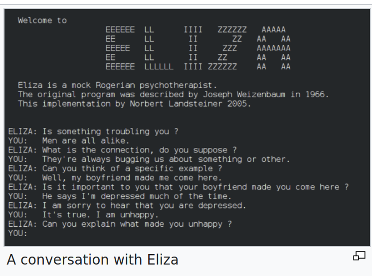
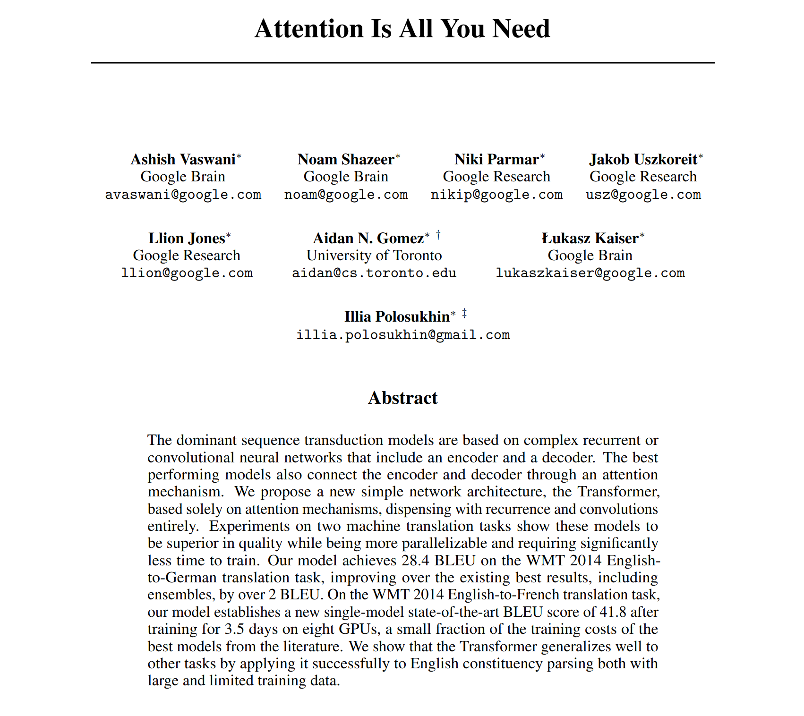
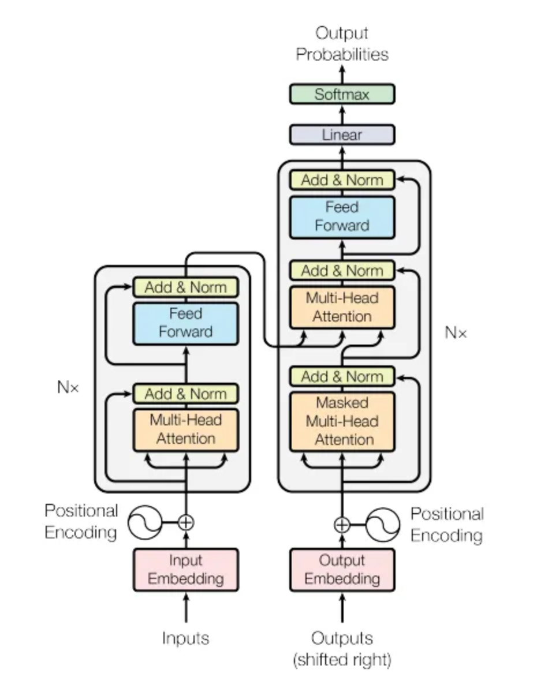
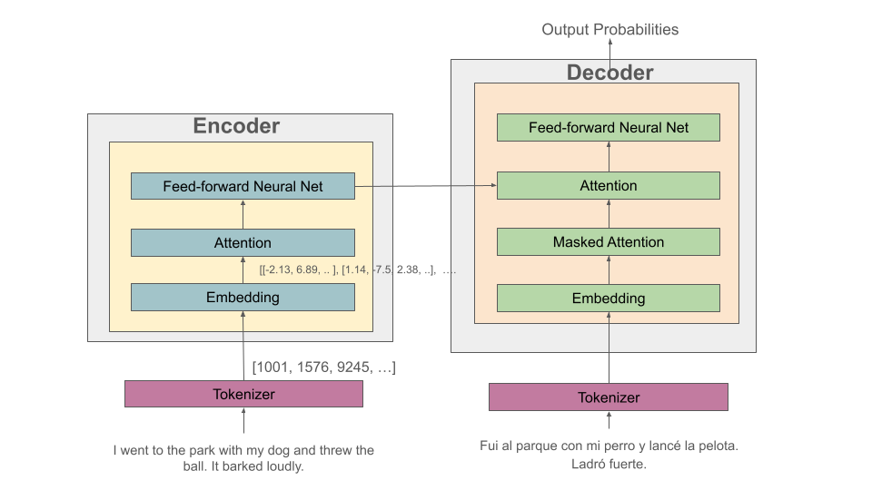
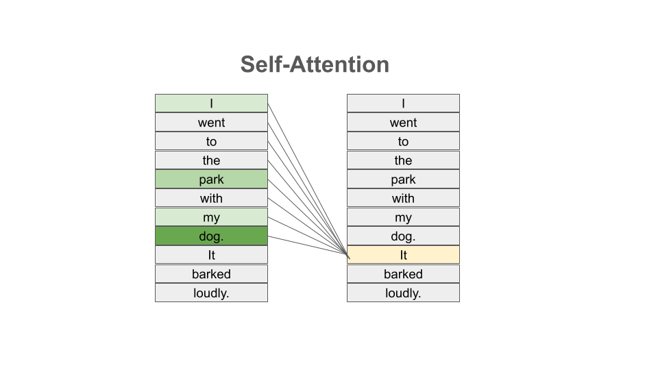

Introduction to Transformers 
=============================
In this module, we introduce the transformer architecture and cover the primary 
components including tokenization, language embedding, self-attention and multi-head 
attention, and the feed-forward network block. We'll motivate the discussion by looking 
at Natural language Processing (NLP) tasks, such as language translation, which were 
the original focus of the creators of the transformer. 

By the end of this unit, students should be able to:

1. Understand the basics of NLP and examples of the types of tasks it studies. 
2. Explain at a high level the transformer architecture and intuitively the responsibilities of 
   each major component, including the tokenizer, language embedding, attention, and feed-forward network blocks. 
3. Understand the difference between encoders, decoders, and transformers that include both an encoder 
   and a decoder. 

Background on Natural Language Processing (NLP)
----------------------------------------------
Last week, we built neural networks that transformed fixed-size numerical inputs into predictions. 
We looked specifically at image classification, a computer vision problem, and we saw how using models 
with many layers, called a *deep neural network*, can improve performance. 
A transformer is also a neural network. It contains learned parameters, makes predictions through a 
forward pass, and is trained by reducing a loss.

The transformer architecture that we will introduce was originally built to 
deal with natural language processing (NLP) tasks, specifically the task of language translation;
that is, translating text from English to Spanish or from Russian to French, etc. In general,
NLP focuses on tasks involving a computer understanding text data, such as that in books, 
articles, web pages, social media posts, etc. Some common NLP tasks include the following: 

1. *Sentiment Analysis:* what is the sentiment expressed by the text? For example, does the author 
   express a favorable or unfavorable opinion of a book, article, website, product, etc.? 
2. *Text classification:* for example, classifying a word by part of speech (e.g., noun, verb, adjective), 
   a book or article by topic (mathematics, computer science, biology), classifying an email as spam or 
   not spam, etc. 
   Sentiment analysis can be thought of a special case of text classification where we are classifying the 
   sentiment expressed into two classes (*favorable* and *unfavorable*). 
3. *Language translation:* translating a text from English to French or from Russian to Spanish, etc. 
4. *Question and Answer:* Providing answers to questions posed in natural language; e.g., Question: *"Who was the 
   first president of the United States?"* Answer: *"George Washington"*.
5. *Text generation:* for example, filling in the end of a sentence (e.g., autocomplete), 
   filling in masked/blanked out words within sentences, generating entire new sentences from a prompt. Language 
   translation and question and answer can be thought of as a special case of tex generation. 

NLP is one of the oldest areas of AI and has a long history dating back at least to the 1950s. 
One of the first efforts to garner public attention was the Georgetown-IBM experiment in 1954, which 
attempted automatically translate Russian sentences to English.

Here is a screenshot from an early, famous NLP program called ELIZA, developed at MIT between 1964 and 
1967. THe ELIZA program prompted users with questions in natural language text and enabled them to 
submit answers, also in natural language. The goal was to simulate a psychotherapy session. 

ELIZA was able to resemble human-like behaviors on occasion, though its practical use was relatively 
limited.

In the 1970s, NLP researchers introduced the notion of *ontologies*, that is, formally structured and 
controlled vocabularies for specific topics or areas. It was during this time that the first chatbot 
programs were written. In the early 1970s, the chat program PARRY was developed and hooked up to 
ELIZA resulting in the following dialog. 

In the 1980s and 1990s, statistical methods began to be used on NLP tasks, with some success. 
However, with the growth of the internet and available data, these methods were
overshadowed by artificial neural networks and ultimately deep learning models trained on 
large amounts of data. 

Transformers Overview
----------------------

The main architectural difference between transformers and other ANN architectures we have looked at 
is that transformers are designed to process *sequential data*. 
Sequential data is just data that contains an ordered structure or a temporal dimension.
In NLP, the sequence consists of pieces of text, and the order of those pieces matters greatly. 

For example, consider two sentences: 

* The food was good, not bad at all
* The food was bad, not good at all

These two sentences have opposite meaning even though they are are comprised of the exact same 8 words:

* all, at, bad, food, good, not, the, was 

Therefore, if we want our model to have any chance at understanding the meaning of the text, we must 
consider the ordering of the words. 

The overarching structure we will review today can be depicted as follows: 

.. math:: 

    \text{text}
    \rightarrow
    \text{tokens}
    \rightarrow
    \text{embeddings and positions}
    \rightarrow
    \text{attention}
    \rightarrow
    \text{feed-forward network}
    \rightarrow
    \text{output}

The Transformer architecture was initially presented in a paper from 2017, 
entitled "Attention Is All You Need". It made famous the notion of *attention*, one of the key 
architectural components we will cover today. 

A real transformer contains multiple repetitions of these operations, together with some additional operations 
such as normalization. Today we will focus only on the basic components and their primary role in the 
architecture. 

Tokenizers 
-----------
We know that an ANN cannot work directly on text data. Instead, they require numeric data. Thus, we 
must have a way to translate text into numbers. A *tokenizer* is a function that 
transforms text input into a sequence of integers. It does this by first dividing an input text 
into units called tokens. A token might represent:

* a complete word
* part of a word
* punctuation
* whitespace
* a special control symbol

There are different ways to tokenize text, but in general, the following methods are among the most 
popular that have been used: 

1. Map every word to a unique integer. 
2. Map ever character to a unique integer. 
3. Map specific word-fragments to unique integers. 

In all of the options above, we use a 1-hot encoding, but each option uses a different base 
vocabulary for the encoding (unique words, unique characters, and word-fragments)

Option 1 produces the largest index space, as every word gets a unique integer, and there are 
a large number of words (hundreds of thousands in the English language, for example). Option 2 
produces the smallest index space, as the number of unique characters is relatively small (26 
English letters, ignoring capitalization, plus punctuation characters). But option 2 produces 
much longer sequences which may create issues learning patterns from the data. 

The third option is perhaps the method that is most commonly in use today, and it represents a 
compromise between options 1 and 2. The idea is to use common word fragments, including punctuation, so 
that very similar words with the same fragments map to the same index. 

For example, this type of tokenizer might map the word "jumping" to two word fragments:

"jumping" --> "jump" + "ing" --> [1004, 769]

so that the word "jump" would map to the same index as the first part of the 
word "jumping". Similarly, the tokenizer might map "Joe's" to two fragments, "Joe", "'s". 

The integer values that the tokens are mapped to are called token IDs. Generally, the values 
do not have any meaning

Note that the tokenizer is different from the language embedding (the first component depicted 
in the diagram). Text passes through the tokenizer before it gets to the language embedding. 

Language Embedding with Positions 
---------------------------------
The tokenization of text is a relatively straight-forward process that converts words or 
sentences into a list of integers using a 1-hot encoding-like technique, but the index space will typically 
be very large and we don't necessarily have a good notion of distance between similar 
words and phrases. 

In general, we would like to reduce the dimension by mapping the tokens to a lower dimensional 
space in a way that produces a metric that captures the natural similarity between words and
phrases. We can do this is with a *language embedding*. 

The Transformer architecture includes a language embedding component (both for the input to the encoder 
and for the output fed to the decoder) that learns an *embedding 
matrix* with position indexes included in the embedding. In other words, the embedding maps both the 
word *and its position in the sequence* to a numeric value, and these values are improved throughout 
the training process. Essentially, the model learns an embedding of the sparse one-hot encoding
mapping into a much lower-dimensional space. 

Mathematical Formulation 
^^^^^^^^^^^^^^^^^^^^^^^^
Mathematically, we can formulate the language embedding component in a relatively straight-forward way. 

Let :math:`S` be a sequence of :math:`T` tokens :math:`w_j` where each :math:`w_j` is an integer index in 
the vocabulary of size :math:`V`. The embedding matrix, :math:`W_E`, then is a Real-valued matrix of size 
:math:`V \times d`, where :math:`d` is called the embedding dimension and is a fixed hyperparameter 
of the model. We think of each :math:`w_j` as a vector in :math:`\mathbb{R}^V` with a single :math:`1` in 
the index position and 0s elsewhere; that is, :math:`w_j = [0, ..., 0, 1, 0, ..., 0]` is a vector 
of length :math:`V`. Multiplication by :math:`W_E` gives a vector of length :math:`d`; i.e., 

.. math:: 

    \textbf{x}^{tok}_t = \textbf{e}_t \cdot W_E \in \mathbb{R}^d

The idea is that the entries of the matrix :math:`W_E` are part of the learned parameters of the model, 
and the goal is to learn a matrix that maps semantically similar tokens to nearby points in :math:`\mathbb{R}^d`. 
For example, we would like the tokens king, queen, prince, and princess to all be mapped to nearby points in 
:math:`\mathbb{R}^d`. 

In the standard transformer, we also want to encode the position of the token, that is, the :math:`j` in 
:math:`w_j`. We can do this using sinusoidal positional encoding which maps the :math:`t^{th}`
position index to a unique continuous vector :math:`\mathbf{p}_t\in\mathbb{R}^{d}`. For brevity, we exclude the 
details of this mapping. 

The final input representation :math:`\mathbf{x}_t` for token :math:`w_t` is simply the element-wise sum of 
its token embedding and positional vector:

.. math:: 

  \mathbf{x}_t = \mathbf{x}_t^{\text{tok}} + \mathbf{p}_t \in \mathbb{R}^{d}

Packing all :math:`T` token vectors into a single matrix gives our input matrix :math:`X`:

.. math:: 

  X = \begin{bmatrix} \text{--- } \mathbf{x}_1 \text{ ---} \\ \text{--- } \mathbf{x}_2 \text{ ---} \\ \vdots \\ \text{--- } \mathbf{x}_T \text{ ---} \end{bmatrix} \in \mathbb{R}^{T \times d}

Self-Attention 
--------------
Self-attention allows each token to "look at" every other token in the sequence to update its context.
The key intuitive insight is that to understand the meaning of a specific token, we need to 
"pay attention" to a relatively small number of other tokens. 

Let's look at an example: 

  *I went to the park with my dog and threw the ball. It went high in the air.* 

The word *It* in the second sentence is a pronoun and refers to the *the ball* from the previous 
sentence. Pronouns like it, she, they, etc., almost always refer to another noun introduced previously. 
But there are a couple of key words that we need to "pay attention" to in order to resolve that *it* 
refers to *the ball*. Which words are those? 

Consider a slight variation: 

  *I went to the park with my dog and threw the ball. It barked loudly.*

In this case, the first sentence is unchanged, but the change to second sentence now means that 
the *It* in the second sentence refers to *my dog*, not the ball. 

In the first case, to resolve the *It* in the second sentence, the import words are: 

* threw, ball, high, air 

and in the second case, the important words are: 

* dog, barked, loudly 

We can see from this simple example just how challenging the task is. Understanding the meaning of words, 
even in these very simple cases, can involve using words in previous sentences and words that come after 
the word in the current sentence. 

Mathematical Formulation
^^^^^^^^^^^^^^^^^^^^^^^^
How should we formulate the problem of attention mathematically? We begin with an input matrix, :math:`X`, 
the result of the language embedding described previously. The original attention paper described three 
projections of :math:`X` using three matrices, :math:`W_Q, W_K, W_V \in \mathbb{R}^{d\times d}` called 
the **query**, **key**, and **value** matrices, respectively. The entries 
of these matrices are learned parameters of the model, and each has a different focus: 

* the query represents what the current position is looking for
* he key represents how another position can be matched
* the value contains the information that is pushed forward into the next layer 

To determine how strongly position :math:`i` should attend to position :math:`j`, the model 
compares query :math:`q_i` with key :math:`k_j`:

.. math:: 

    s_{ij} = \frac{q_i\cdot k_j^\mathsf{T}}{\sqrt{d_k}}

Intuitively, a dot product is used because it computes a similarity between two vectors.
The division by :math:`\sqrt{d_k}` keeps the score magnitudes from growing excessively as the vector 
dimension increases.

Feed-Forward Network 
---------------------

The final major component of the transfoer is a feed-forward neural network, just like we have seen 
in the previous lectures. 

includes a fully connected feed-forward network with 1 hidden layer. These feed-forward networks 
are exactly like the networks we looked at the beginning of Unit 3. In the original paper, 
two convolutions with kernel size 1, input and output dimensionality of 512, and 
inner-layer dimensionality of 2048 were used. 

The Transformer: A Family of Architectures 
------------------------------------------
The transformer architecture as presented in the original *Attention Is All You Need* paper is depicted 
below. There are two primary components in the architecture: an *encoder*, depicted on the left half, 
and a *decoder*, depicted on the right half. You will notice that the two halves are almost identical, 
with the decoder adding just one additional component called the *Masked Multi-head Attention* instead 
of the plain (i.e., unmasked) multi-head attention.  

Thus, if we just focus on one side of the architecture, we see the primary components (from bottom to top) 
thay we have just discussed:

* The language embedding 
* The attention component 
* The feed forward network 

Encoder-Decoder, Encoder-only and Decoder-only Model Variants 
^^^^^^^^^^^^^^^^^^^^^^^^^^^^^^^^^^^^^^^^^^^^^^^^^^^^^^^^^^^^^^
The Transformer architecture above includes a left half and a right half called the *encoder* 
and the *decoder*, respectively. The difference 
between the two is that the decoder includes a *masked* multi-head attention mechanism. The word 
*masked* here refers to the fact that some of the attention matrix for the input sequence is hidden 
from the network. Specifically, the part of the sequence after the index currently being predicted 
is masked. Said differently, with masked attention, positions can only utilize the attention weights 
of positions that precede them. 

Intuitively, we may want to use masking in different ways, or not at all, depending on the task. 
For this reason, encoder-only and decoder-only variants of the transformer model have been created. 

For example, with sentiment analysis, there is no need for masking, as we want the model to be 
able to use the entire input sequence for the prediction. Therefore, we may use an encoder-only 
model for these tasks. 

On the other hand, for the task of text generation or sentence completion (e.g., autofill), we want 
the model to *only* be able to use the part of the sequence that came before the prediction position. 
Therefore, we may use a decoder-only model for these tasks.  

Finally, for language translation (which was the task originally studied in the 
"Attention Is All You Need" paper), we may want the model to see the entire input language sequence 
but only be able to see the part of the attentions of the words that have already been translated 
in the target language. This gives intuition behind the original encoder-decoder model: the encoder 
utilizes attentions for all of the inputs words (e.g., English), but the decoder can only see the 
attentions of the words that have already been translated (e.g., French).

Working Through an Example 
--------------------------

Let's discuss a specific example to try and make this more concrete. Let's assume we have a language translation 
task and we are translating the sentence "I went to the park with my dog and threw the ball. It barked loudly."

The high-level processing that will take place is depicted in the following diagram: 

We have depicted the enoder on the left and the decoder on the right. The English sentence is flowing from the 
bottom on the left side, while the Spanish translation is flowing through the decoder on the right. 

1. The English sentence first is tokenized into a series of token id's. 
2. This list of token id's are then converted to vectors via the language embedding component. 
3. Next, an attention layer computes the relative importance of other tokens in the sequence. This 
   is depicted in the following diagram. 
4. The same thing is happening on the decoder side, except that the masked attention component ensures that 
   the model can only compute attention for the previous elements in the sequence. (Intuitively: we can only
   use the words we have already translated). 
5. The attention outputs are fed to the feed-forward layer, and the encoder feed-forward layer outputs are 
   fed to the decoder. 

Keep in mind that just like all other ML models, there is a *training phase* and an *inference phase* 
with transformers. During training, the parameters (weights and biases) of all model components, including 
the Embedding, Attention, and Feed-Forward layers, are updated based on stochastic gradient decent. Only 
after sufficient training loops with sufficiently many examples will the model achieve good accuracy. 

.. note:: 

    What we have discussed is the "standard transformer" architecture from the original *Attention is 
    All You Need* paper. Modern transformer architectures have evolved from it in some ways. For example, 
    the self-attention we described does not leverage token position directly; rather, it leverages position 
    indirectly because the vectors :math:`Q` and :math:`K` already contain the positional signal baked 
    directly into them.
    Some modern transformers take a different approach where, for example, attention leverages position 
    explicitly. 
